R Notebook
================

\#partie 1

``` r
library(phyloseq)
library(ggplot2)
library(dplyr)
```

    ## 
    ## Attaching package: 'dplyr'

    ## The following objects are masked from 'package:stats':
    ## 
    ##     filter, lag

    ## The following objects are masked from 'package:base':
    ## 
    ##     intersect, setdiff, setequal, union

``` r
devtools::load_all(path="course-material-main")
```

    ## ℹ Loading ANF_metaB

``` r
output_beta <- here::here("outputs", "beta_diversity")
if (!dir.exists(output_beta)) dir.create(output_beta, recursive = TRUE)
```

``` r
#charger les data
physeq <- readRDS(here::here("data",
                             "asv_table",
                             "phyloseq_object_alpha_beta_div.rds"))
```

\#partie 2

``` r
#Normalisation des tables de données
#Ici on le fait par raréfaction : nous sous-échantillons les reads de chaque échantillon sans remise à une "profondeur constante"
rowSums(physeq@otu_table@.Data)
```

    ## S11B  S1B  S2B  S2S  S3B  S3S  S4B  S4S  S5B  S5S  S6B  S6S  S7B  S7S  S8B  S8S 
    ##  975  837  893  983  878  889  917 1077 1018 1006 1076  937  878  936  846  958 
    ##  S9B  S9S 
    ##  888  991

``` r
#on va faire des tableaux de ces résultats et regarder les rangs d'abondance de nos reads

readsumsdf <- data.frame(nreads = sort(taxa_sums(physeq), decreasing = TRUE),
                        sorted = 1:ntaxa(physeq),
                        type = "OTUs")

tmp <- data.frame(nreads = sort(sample_sums(physeq), decreasing = TRUE), 
                  sorted = 1:nsamples(physeq),
                  type = "Samples")

readsumsdf <- rbind(readsumsdf, tmp)

head(readsumsdf)
```

    ##      nreads sorted type
    ## ASV1   1558      1 OTUs
    ## ASV2    973      2 OTUs
    ## ASV3    899      3 OTUs
    ## ASV4    833      4 OTUs
    ## ASV5    767      5 OTUs
    ## ASV6    654      6 OTUs

``` r
ggplot(readsumsdf, aes(x = sorted, y = nreads)) +
  geom_bar(stat = "identity") +
  ggtitle("Total number of reads") +
  scale_y_log10() +
  facet_wrap(~type, nrow = 1, scales = "free")
```

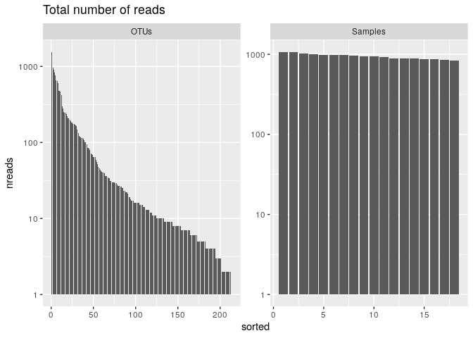<!-- -->

``` r
#on veut s'assurer que l'effort des échantillonnages est le même pour tous les échantillons 
# ??
# s'assurer que c'est reproductible
set.seed(10000)

# les reads minimums pour un échantillon
min(rowSums(physeq@otu_table@.Data))
```

    ## [1] 837

``` r
# le miminum de reads dans un échantillon est 837
# faisons l'échantillonnage aléatoire pour 800 reads par échantillon pour appliquer le processus à chaque échantillonnage pour avoir le même nombre partout (mettre tout le monde au meme niveau, le plus bas)
physeq_rar <- rarefy_even_depth(physeq, sample.size = 800)
```

    ## You set `rngseed` to FALSE. Make sure you've set & recorded
    ##  the random seed of your session for reproducibility.
    ## See `?set.seed`

    ## ...

    ## 5OTUs were removed because they are no longer 
    ## present in any sample after random subsampling

    ## ...

``` r
rowSums(physeq_rar@otu_table@.Data) #combien de reads par échantillon
```

    ## S11B  S1B  S2B  S2S  S3B  S3S  S4B  S4S  S5B  S5S  S6B  S6S  S7B  S7S  S8B  S8S 
    ##  800  800  800  800  800  800  800  800  800  800  800  800  800  800  800  800 
    ##  S9B  S9S 
    ##  800  800

``` r
physeq
```

    ## phyloseq-class experiment-level object
    ## otu_table()   OTU Table:         [ 213 taxa and 18 samples ]
    ## sample_data() Sample Data:       [ 18 samples by 21 sample variables ]
    ## tax_table()   Taxonomy Table:    [ 213 taxa by 7 taxonomic ranks ]
    ## phy_tree()    Phylogenetic Tree: [ 213 tips and 212 internal nodes ]
    ## refseq()      DNAStringSet:      [ 213 reference sequences ]

``` r
physeq_rar
```

    ## phyloseq-class experiment-level object
    ## otu_table()   OTU Table:         [ 208 taxa and 18 samples ]
    ## sample_data() Sample Data:       [ 18 samples by 21 sample variables ]
    ## tax_table()   Taxonomy Table:    [ 208 taxa by 7 taxonomic ranks ]
    ## phy_tree()    Phylogenetic Tree: [ 208 tips and 207 internal nodes ]
    ## refseq()      DNAStringSet:      [ 208 reference sequences ]

``` r
tmp <- zCompositions::cmultRepl(physeq@otu_table,
                                method = "CZM",
                                label = 0,
                                z.warning = 1)

physeq_clr_asv <- apply(tmp, 1, function(x) log(x) - mean(log(x)))
```

``` r
#Tous le monde à la même enseigne : on centre et on passe en log
physeq_clr <- physeq
otu_table(physeq_clr) <- otu_table(t(physeq_clr_asv),
                                   taxa_are_rows = FALSE)
data.frame(physeq_clr@otu_table@.Data[1:5, 1:10])
```

    ##          ASV1       ASV2     ASV3       ASV4     ASV5     ASV6       ASV7
    ## S11B 5.172800  3.6295018 4.853277  4.6591212 4.876534 4.099505  4.4536772
    ## S1B  4.630559 -0.6264429 3.561361 -0.6264429 4.357692 4.297068 -0.6264429
    ## S2B  4.065517 -0.7557464 3.859665  3.0123670 4.041986 4.255561 -0.7557464
    ## S2S  5.042825  4.8740037 4.738829  2.8930022 5.003215 4.169296  3.9916145
    ## S3B  4.440233 -0.6954498 3.828432 -0.6954498 4.254516 4.653155 -0.6954498
    ##            ASV8       ASV9      ASV10
    ## S11B  3.9369865  4.1241980 -0.6524920
    ## S1B  -0.6264429  3.7217036  4.4863097
    ## S2B  -0.7557464 -0.7557464  4.0655169
    ## S2S   4.6847617  4.2367369 -0.6558837
    ## S3B  -0.6954498 -0.6954498  4.4057470

\#partie 3

``` r
#la première étape dans bcp de projets de microbiome c'est de visualiser l'abondance relative des organismes à un rang taxonomique spé
# representation en arbre et les plots compilés sont deux façons de le faire
physeq_phylum <- physeq_rar %>%
  tax_glom(taxrank = "Family") %>%                     # agglomerate at the Family level
  transform_sample_counts(function(x) {x/sum(x)} ) %>% # Transform to rel. abundance
  psmelt() %>%                                         # Melt to long format
  filter(Abundance > 0.02) %>%                         # Filter out low abundance taxa
  arrange(Family)                                      # Sort data frame alphabetically by phylum

head(physeq_phylum)
```

    ##    OTU Sample Abundance SampName   Geo Description groupe Pres PicoEuk Synec
    ## 1 ASV7    S4S 0.2483311      S4S North     North4S    NBS   78    2220  3130
    ## 2 ASV7    S4B 0.2129784      S4B North     North4B    NBF   78    2220  3130
    ## 3 ASV7    S5S 0.1833085      S5S North     North5S    NBS    0    1620 56555
    ## 4 ASV7    S2B 0.1776119      S2B North     North2B    NBF   59     890 25480
    ## 5 ASV7    S3S 0.1745283      S3S North     North3S    NBS    0     715 26725
    ## 6 ASV7    S5B 0.1741214      S5B North     North5B    NBF   42    1620 55780
    ##   Prochloro NanoEuk Crypto SiOH4   NO2   NO3   NH4   PO4    NT    PT   Chla
    ## 1     29835    2120    235 2.457 0.099 1.087 0.349 0.137 8.689 3.129 0.0000
    ## 2     29835    2120    235 2.457 0.099 1.087 0.349 0.137 8.689 3.129 0.0000
    ## 3     22835    2560    945 2.669 0.136 0.785 0.267 0.114 9.146 3.062 0.0000
    ## 4     16595     670    395 2.592 0.105 1.125 0.328 0.067 9.378 3.391 0.0000
    ## 5     16860     890    200 1.656 0.098 0.794 0.367 0.095 7.847 2.520 0.0000
    ## 6     23795    2555   1355 2.028 0.103 1.135 0.216 0.128 8.623 3.137 0.0102
    ##         T       S Sigma_t  Kingdom         Phylum               Class
    ## 1 18.8515 37.4542 26.9415 Bacteria Proteobacteria Alphaproteobacteria
    ## 2 18.8515 37.4542 26.9415 Bacteria Proteobacteria Alphaproteobacteria
    ## 3 24.1789 38.3213 26.1065 Bacteria Proteobacteria Alphaproteobacteria
    ## 4 22.6824 37.6627 26.0521 Bacteria Proteobacteria Alphaproteobacteria
    ## 5 22.5610 37.5960 26.0332 Bacteria Proteobacteria Alphaproteobacteria
    ## 6 24.1905 38.3192 26.1037 Bacteria Proteobacteria Alphaproteobacteria
    ##              Order                  Family
    ## 1 Rhodospirillales AEGEAN-169 marine group
    ## 2 Rhodospirillales AEGEAN-169 marine group
    ## 3 Rhodospirillales AEGEAN-169 marine group
    ## 4 Rhodospirillales AEGEAN-169 marine group
    ## 5 Rhodospirillales AEGEAN-169 marine group
    ## 6 Rhodospirillales AEGEAN-169 marine group

``` r
#pdf(file="treemap.pdf", wi = 7, he = 7)

treemap::treemap(physeq_phylum, index=c("Class", "Family"), vSize="Abundance", type="index",
        fontsize.labels=c(15,12),                # size of labels. Give the size per level of aggregation: size for group, size for subgroup, sub-subgroups...
        fontcolor.labels=c("white","black"),    # Color of labels
        fontface.labels=c(2,1),                  # Font of labels: 1,2,3,4 for normal, bold, italic, bold-italic...
        align.labels=list(
          c("center", "center"), 
          c("left", "bottom")),                 # Where to place labels in the rectangle?
        overlap.labels=0.5,                      # number between 0 and 1 that determines the tolerance of the overlap between labels. 0 means that labels of lower levels are not printed if higher level labels overlap, 1  means that labels are always printed. In-between values, for instance the default value .5, means that lower level labels are printed if other labels do not overlap with more than .5  times their area size.
        inflate.labels=F, # If true, labels are bigger when rectangle is bigger.
        border.col=c("black","white"),          #Color of the boders separating the taxonomic levels
        border.lwds=c(4,2),
        #palette = "Set3",                        # Select your color palette from the RColorBrewer presets or make your own.
        fontsize.title=12
)
```

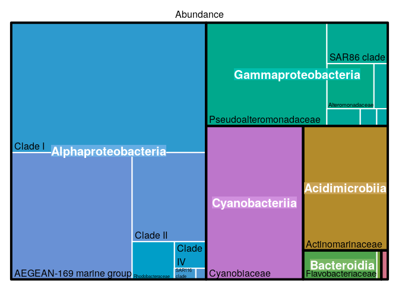<!-- -->

``` r
#dev.off()
```

``` r
tmp <- transform_sample_counts(physeq,function(x) {x/sum(x)} ) %>%
  psmelt() %>%
  group_by(Family, Class) %>%
  summarise(abundance = sum(Abundance)) %>%
  na.omit()
```

    ## `summarise()` has grouped output by 'Family'. You can override using the
    ## `.groups` argument.

``` r
ggplot(tmp,aes(area=abundance,label=Family,fill=Class,subgroup=Class))+
  treemapify::geom_treemap()+
  treemapify::geom_treemap_subgroup_border() +
  treemapify::geom_treemap_subgroup_text(place = "centre",
                                         grow = T,
                                         alpha = 0.5,
                                         colour = "black",
                                         fontface = "italic",
                                         min.size = 0) +
  treemapify::geom_treemap_text(colour = "white",
                                place = "topleft",
                                reflow = TRUE)+
  theme(legend.position="none")
```

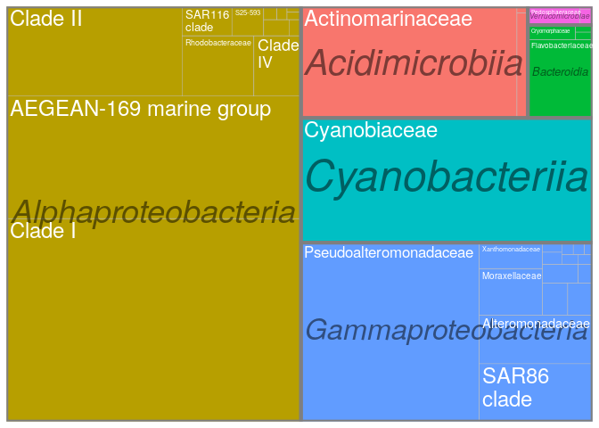<!-- -->

``` r
ggsave(here::here(output_beta,"treemap_treemapify.pdf"))
```

    ## Saving 7 x 5 in image

``` r
# ici on peut observer que la meta-communauté est dominée par des clades typiquement marins comme le groupe marin AEGEAN dans les alphaprotéobactéries ou le clade SAR86 dans les gammaprotéobactéries. Donc tout va bien pour le moment ;)
```

``` r
#LE blanc ce sont les inconnus,on n'a pas réussi à les attribuer à une famille.
ggplot(physeq_phylum, aes(x = Sample, y = Abundance, fill = Family)) + 
  geom_bar(stat = "identity") +
  # facet_wrap(~Treatment, nrow=1, scales = "free_x") +
  ylab("Relative Abundance (Family > 2%)") +
  scale_y_continuous(expand = c(0,0)) + #remove the space below the 0 of the y axis in the graph
  ggtitle("Community composition") +
  theme_bw() +
  theme(axis.title.x = element_blank(),
        axis.text.x = element_text(angle = 45, size = 10,
                                   hjust = 0.5, vjust = 0.8),
        axis.ticks.x = element_blank(),
        panel.background = element_blank(), 
        panel.grid.major = element_blank(),  #remove major-grid labels
        panel.grid.minor = element_blank())  #remove minor-grid labels
```

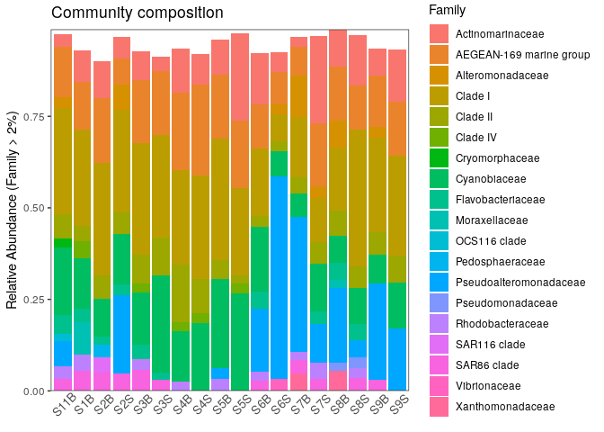<!-- -->

``` r
ggsave(here::here(output_beta, "asv_composition.pdf"))
```

    ## Saving 7 x 5 in image

``` r
#ici on peut déjà voir une diff de compo au niveau de Famille avec un enrichissement dans les pseudoalteromonadaceae dans qqls échantillons et cyanobiaceae
#il faut noter que nous sommes limités par notre habilité à discerner plus de 9-12 couleurs
```

\#partie 4

``` r
#Au fil des ans, les écologistes ont inventé de nombreuses façons de quantifier la dissimilarité entre des paires d'écosystèmes. Quatre composantes de la bêta-diversité des communautés d'espèces peuvent être évaluées à l'aide de différentes distances ou dissimilarités. Les distances ou dissimilarités de composition ne tiennent pas compte de l'abondance relative des taxons, mais uniquement de leur présence (détection) ou de leur absence, ce qui peut les rendre (trop) sensibles aux taxons rares, aux artefacts de séquençage et aux choix de filtrage de l'abondance. À l'inverse, les distances ou dissimilarités structurelles accordent (peut-être trop) d'importance aux taxons très abondants lors de la détermination des dissimilarités. Les distances ou dissimilarités phylogéniques tiennent compte de la parenté phylogénétique des taxons/séquences de vos échantillons lors du calcul de la dissimilarité, ce qui n'est pas le cas des distances ou dissimilarités taxonomiques.
```

``` r
#Indice de jaccard binaire : présence / absence 
physeq_rar_jaccard <- phyloseq::distance(physeq_rar,
                                         method = "jaccard",
                                         binary = TRUE)

# trick to avoid negative egein values in PCoA
# it recreates what ade4::dist.binary() does
physeq_rar_jaccard <- sqrt(physeq_rar_jaccard)
```

``` r
#le package a besoin d'un arbre enraciné dans les data où il peut prendre
ape::is.rooted(physeq_rar@phy_tree)
```

    ## [1] TRUE

``` r
#calculer les distances
#UniFrac = autre indice de bétâ-diversité : intersection entre les échantillons ; pondère l'abondance relative des ASV par leur distance phylogénétique
unifracs <- GUniFrac::GUniFrac(physeq_rar@otu_table@.Data, physeq_rar@phy_tree, alpha=c(0, 0.5, 1))$unifracs
```

``` r
#l'objet unifracs est une liste qui contient 5 matrices de distance qui correspondent à : weighted UniFrac (d_1), the unweighted UniFrac (d_UW), Variance adjusted UniFrac (d_VAW), GUniFrac with alpha = 0, GUniFrac with alpha = 0.5

physeq_rar_du <- unifracs[, , "d_UW"]   # Unweighted UniFrac
```

``` r
# physeq_rar_bray <- vegan::vegdist(physeq_rar@otu_table@.Data, method = "bray")

tmp <- transform_sample_counts(physeq,function(x) {x/sum(x)} )
physeq_rar_bray <- phyloseq::distance(tmp, method = "bray")
```

``` r
physeq_rar_dw <- unifracs[, , "d_1"]   # Weighted UniFrac
```

``` r
#on peut calculer directement les distances, il y a 44 options de méthodes supportées explicitement dans le package phyloseq
#à travers chaque méthode de distance on sauvegardera chaque plot et list et les résultats combinés dans un grahique 
dist_methods <- unlist(distanceMethodList)
data.frame(position = seq_along(dist_methods),
           dist_methods)
```

    ##             position dist_methods
    ## UniFrac1           1      unifrac
    ## UniFrac2           2     wunifrac
    ## DPCoA              3        dpcoa
    ## JSD                4          jsd
    ## vegdist1           5    manhattan
    ## vegdist2           6    euclidean
    ## vegdist3           7     canberra
    ## vegdist4           8         bray
    ## vegdist5           9   kulczynski
    ## vegdist6          10      jaccard
    ## vegdist7          11        gower
    ## vegdist8          12     altGower
    ## vegdist9          13     morisita
    ## vegdist10         14         horn
    ## vegdist11         15    mountford
    ## vegdist12         16         raup
    ## vegdist13         17     binomial
    ## vegdist14         18         chao
    ## vegdist15         19          cao
    ## betadiver1        20            w
    ## betadiver2        21           -1
    ## betadiver3        22            c
    ## betadiver4        23           wb
    ## betadiver5        24            r
    ## betadiver6        25            I
    ## betadiver7        26            e
    ## betadiver8        27            t
    ## betadiver9        28           me
    ## betadiver10       29            j
    ## betadiver11       30          sor
    ## betadiver12       31            m
    ## betadiver13       32           -2
    ## betadiver14       33           co
    ## betadiver15       34           cc
    ## betadiver16       35            g
    ## betadiver17       36           -3
    ## betadiver18       37            l
    ## betadiver19       38           19
    ## betadiver20       39           hk
    ## betadiver21       40          rlb
    ## betadiver22       41          sim
    ## betadiver23       42           gl
    ## betadiver24       43            z
    ## dist1             44      maximum
    ## dist2             45       binary
    ## dist3             46    minkowski
    ## designdist        47          ANY

``` r
#sélection des distances d'interêt
dist_methods <- dist_methods[c(1, 2, 10, 8)]
dist_methods
```

    ##   UniFrac1   UniFrac2   vegdist6   vegdist4 
    ##  "unifrac" "wunifrac"  "jaccard"     "bray"

``` r
#Loop through each distance method, save each plot to a list, called plist.
plist <- vector("list")

for(i in dist_methods){
  # Calculate distance matrix
  iDist <- phyloseq::distance(physeq_rar, method = i)
  # Calculate PCoA ordination
  iMDS <- ordinate(physeq_rar, "MDS", distance = iDist)
  ## Make plot. Don't carry over previous plot (if error, p will be blank)
  p <- NULL
  # Create plot, store as temp variable, p
  p <- plot_ordination(physeq_rar, iMDS, color= "Geo")
  # Add title to each plot
  p <- p + ggtitle(paste("MDS using distance method ", i, sep=""))
  # Save the graphic to list
  plist[[i]] = p 
}
```

``` r
df <- plyr::ldply(plist, function(x) x$data)
head(df)
```

    ##       .id      Axis.1      Axis.2 SampName   Geo Description groupe Pres
    ## 1 unifrac  0.09023445  0.06150644     S11B South     South5B    SGF   35
    ## 2 unifrac -0.21048836 -0.19946687      S1B North     North1B    NBF   52
    ## 3 unifrac -0.21001002 -0.08655455      S2B North     North2B    NBF   59
    ## 4 unifrac  0.12583068  0.07022248      S2S North     North2S    NBS    0
    ## 5 unifrac -0.31465014 -0.06077941      S3B North     North3B    NBF   74
    ## 6 unifrac -0.16616937  0.01827175      S3S North     North3S    NBS    0
    ##   PicoEuk Synec Prochloro NanoEuk Crypto SiOH4   NO2   NO3   NH4   PO4    NT
    ## 1    5370 46830       580    6010   1690 3.324 0.083 0.756 0.467 0.115 9.539
    ## 2     660 32195     10675     955    115 1.813 0.256 0.889 0.324 0.132 9.946
    ## 3     890 25480     16595     670    395 2.592 0.105 1.125 0.328 0.067 9.378
    ## 4     890 25480     16595     670    395 3.381 0.231 0.706 0.450 0.109 8.817
    ## 5     835 13340     25115    1115    165 1.438 0.057 1.159 0.369 0.174 8.989
    ## 6     715 26725     16860     890    200 1.656 0.098 0.794 0.367 0.095 7.847
    ##      PT   Chla       T       S Sigma_t
    ## 1 4.138 0.0182 23.0308 38.9967 26.9631
    ## 2 3.565 0.0000 22.7338 37.6204 26.0046
    ## 3 3.391 0.0000 22.6824 37.6627 26.0521
    ## 4 3.345 0.0000 22.6854 37.6176 26.0137
    ## 5 2.568 0.0000 21.5296 37.5549 26.2987
    ## 6 2.520 0.0000 22.5610 37.5960 26.0332

``` r
#on peut observer qu'il y a une vraie séparation entre les echantillons du nord et du sud, à part les distances Weighted UniFrac qui tendent à donner plus de poids au ASV les + abondantes qui sont aussi les + frq
#faire des ordinations avec diff indices
names(df)[1] <- "distance"

ggplot(df, aes(Axis.1, Axis.2, color = Geo)) +
  geom_point(size=3, alpha=0.5) +
  theme_bw() +
  facet_wrap(~distance, scales="free") +
  ggtitle("PCoA (MDS) on various distance metrics")
```

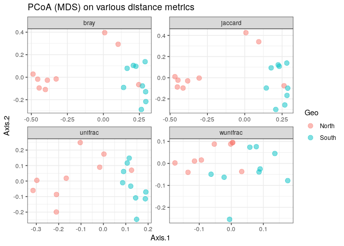<!-- -->
\#partie 5

``` r
#examiner les clusters d'échantillons sur des mesures de dis(similarités)
#les data de microbiome sont compositionelles, on va faire une classification ascendante hierarchique (HAC) des échantillons basée sur la distance Aitchison
#distance matrix calculation
physeq_clr_dist <- phyloseq::distance(physeq_clr, method = "euclidean")
```

``` r
#regardons les diff de clusters obtenus avec 4 critères d'aggrégation
#Simple aggregation criterion
spe_single <- hclust(physeq_clr_dist, method = "single")

#Complete aggregation criterion
spe_complete <- hclust(physeq_clr_dist, method = "complete")

#Unweighted pair group method with arithmetic mean
spe_upgma <- hclust(physeq_clr_dist, method = "average")

#Ward criterion
spe_ward <- hclust(physeq_clr_dist, method = "ward.D")

par(mfrow = c(2, 2))
plot(spe_single, main = "single")
plot(spe_complete, main = "complete")
plot(spe_upgma, main = "UPGMA")
plot(spe_ward, main = "ward")
```

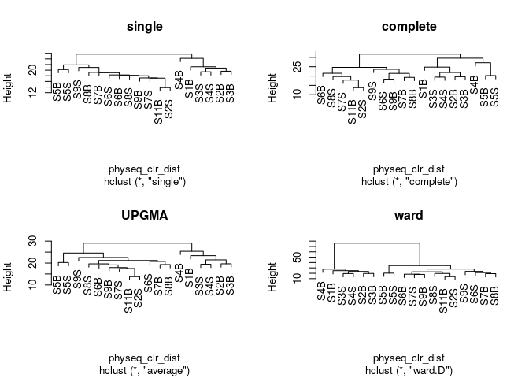<!-- -->

``` r
#ce n'est pas un test stat, c'est une procédure heuristique
#le choix d'un coeff d'association et d'une méthode de clustering influence le résultat, cela accentue l'improtance de choisir une méthode qui est consistante avec les buts de l'analyse
```

``` r
# une matrice cophenetic : represente la distance cophenetique pour tous les pairs d'objets
# une correlation de pearson, appelé correlation de cophenetique ici, peut être calculée entre la matrice de dissimilarité originale et la matrice cophenetique. La méthode avec la plus haute correlation de cophenetique peut être vue comme celle qui produit le meilleur modèle de clustering pour une matrice de distance
#Cophenetic correlation
spe_single_coph <- cophenetic(spe_single)
cor(physeq_clr_dist, spe_single_coph)
```

    ## [1] 0.9447202

``` r
spe_complete_coph <- cophenetic(spe_complete)
cor(physeq_clr_dist, spe_complete_coph)
```

    ## [1] 0.8609329

``` r
spe_upgma_coph <- cophenetic(spe_upgma)
cor(physeq_clr_dist, spe_upgma_coph)
```

    ## [1] 0.958006

``` r
spe_ward_coph <- cophenetic(spe_ward)
cor(physeq_clr_dist, spe_ward_coph)
```

    ## [1] 0.9044309

``` r
plot_coph_cor <- function(cophenetic_distance, hclust_type){

  # first calculate the correlation between
  # the cophenetic distance and the observed distance
  cor_res <- round(cor(physeq_clr_dist, cophenetic_distance),3)

  # generate a scatter plot to visualise
  # the relationship
  plot(x = physeq_clr_dist,
     y = cophenetic_distance,
     xlab = "Aitchison distance",
     ylab = "Cophenetic distance",
     xlim = c(10, 35), ylim = c(10, 35),
     main = c(hclust_type, paste("Cophenetic correlation ", cor_res)))
  abline(0, 1)
}

par(mfrow=c(2,2))

plot_coph_cor(cophenetic_distance = spe_complete_coph,
              hclust_type = "Single linkage")

plot_coph_cor(cophenetic_distance = spe_complete_coph,
              hclust_type = "Complete linkage")

plot_coph_cor(cophenetic_distance = spe_upgma_coph,
              hclust_type = "Average linkage")

plot_coph_cor(cophenetic_distance = spe_ward_coph,
              hclust_type = "Ward linkage")
```

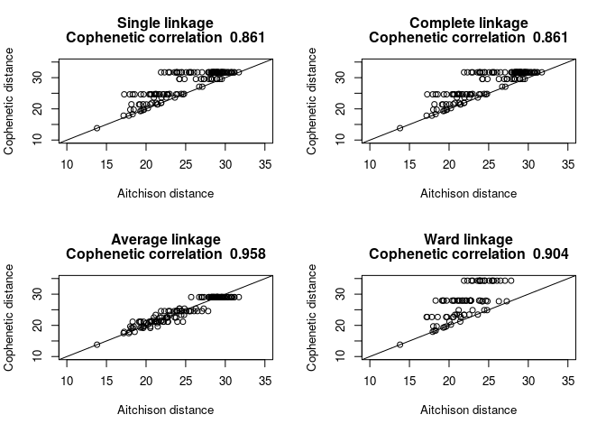<!-- -->

``` r
# pour interpreter et comparer les résultats de clustering, on cherche des cluster interpretables, on doit prendre une décision : à quel niveau on doit couper le dendogram (bcp d'articles publiés pour trouver le bon nbr de cluster dans les dataset) les niveaux de fusion d'un dendogram sont les valeurs de dissimilarité où il y a une fusion de deux branches d'un dendogram. Faire un plot des valeurs de niveau de fusion peut aider à définir un niveau de cut (où on va couper)
#Fusion level plot
par(mfrow = c(1, 1))

plot(x = spe_upgma$height,
     y = phyloseq::nsamples(physeq_clr):2,
     type = "S",
     main = "Fusion levels - Aitchison - Average",
     ylab = "k (number of cluster)",
     xlab = "h (node height)")

text(x = spe_upgma$height,
     y = phyloseq::nsamples(physeq_clr):2,
     labels = phyloseq::nsamples(physeq_clr):2,
     col = "red",
     cex = 0.8)
```

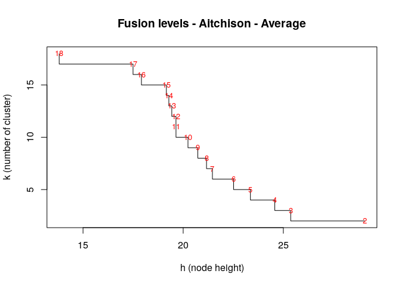<!-- -->

``` r
# de la droite vers la gauche, ce graphique montre les sauts après chaque fusion entre deux groupes
#on utilisera le packaging d'après (qui ne fonctionne pas) pour cumuler 24 indices pour confirmer le bon nombre de cluster dans le dataset

install.packages("NbClust", lib = ".")
library("NbClust", lib.loc = ".")
nclust <- nb_clust_all(data = t(physeq_clr_asv), seed = 1000) 
```

    ## [1] "Trying kl index..."
    ## [1] "Trying ch index..."
    ## [1] "Trying hartigan index..."
    ## [1] "Trying scott index..."
    ## [1] "Trying cindex index..."
    ## [1] "Trying db index..."
    ## [1] "Trying silhouette index..."
    ## [1] "Trying duda index..."
    ## [1] "Trying pseudot2 index..."
    ## [1] "Trying beale index..."
    ## [1] "Trying ratkowsky index..."
    ## [1] "Trying ball index..."
    ## [1] "Trying ptbiserial index..."
    ## [1] "Trying gap index..."
    ## [1] "Trying frey index..."
    ## [1] "Trying mcclain index..."
    ## [1] "Trying gamma index..."
    ## [1] "Trying gplus index..."
    ## [1] "Trying tau index..."
    ## [1] "Trying dunn index..."
    ## [1] "Trying hubert index..."

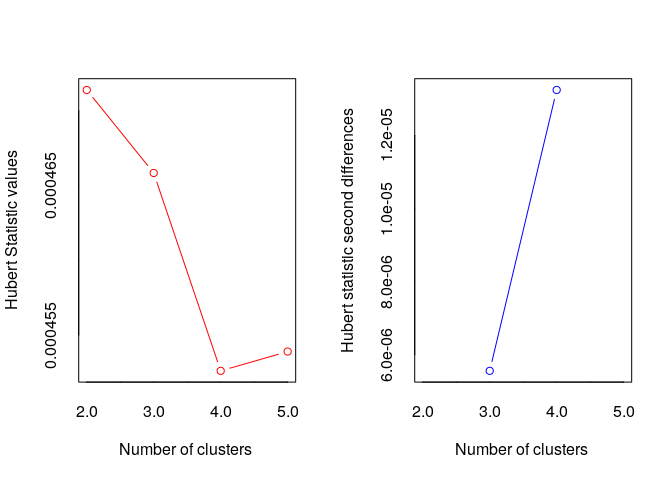<!-- -->

    ## *** : The Hubert index is a graphical method of determining the number of clusters.
    ##                 In the plot of Hubert index, we seek a significant knee that corresponds to a 
    ##                 significant increase of the value of the measure i.e the significant peak in Hubert
    ##                 index second differences plot. 
    ##  
    ## [1] "Trying sdindex index..."
    ## [1] "Trying dindex index..."

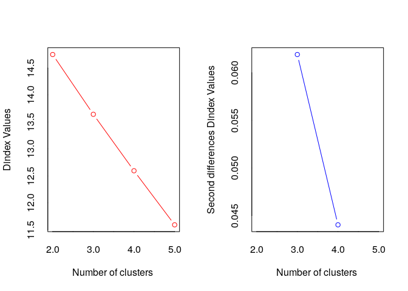<!-- -->

    ## *** : The D index is a graphical method of determining the number of clusters. 
    ##                 In the plot of D index, we seek a significant knee (the significant peak in Dindex
    ##                 second differences plot) that corresponds to a significant increase of the value of
    ##                 the measure. 
    ##  
    ## [1] "Trying sdbw index..."
    ## Based on a number of criteria, we will select 2 clusters.

``` r
#couper le dendogramme pour obtenir "k" groupes et comparer leur compo
k <- 2 # nbr de groupes donnés par le graphique de level de fusion

#couper le dendo
spe_upgma_clust <- cutree(tree = spe_upgma, k = k)
table(spe_upgma_clust)
```

    ## spe_upgma_clust
    ##  1  2 
    ## 12  6

``` r
spe_upgma_clust2 <- data.frame(UPGMA_clusters = spe_upgma_clust)
```

``` r
# faire un graphique avec des labels de groupe
plot(spe_upgma,
     hang = -1,
     ylab = "Height",
     main="Aitchison distance - UPGMA")

rect.hclust(spe_upgma,
            k = k,
            border = 2:6,
            cluster = spe_upgma_clust)

legend("topright",
       paste("Cluster", 1:k),
       pch = 22,
       col = 2:(k + 1),
       bty = "n")
```

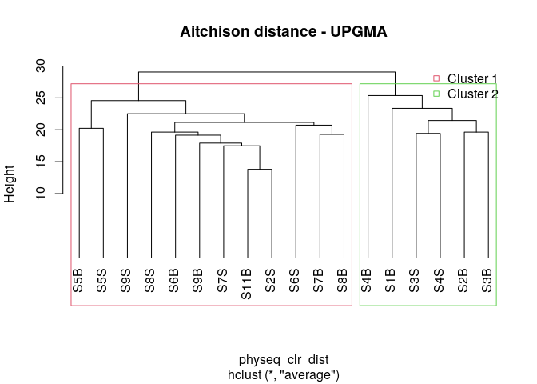<!-- -->

``` r
#il y a plusieurs façons de mesurer la robustesse d'un algorithme de clustering :
# - Dunn index : calculer comme un ratio des plus petites distances inter-cluster et des plus grandes -> plus le DI est grand, mieux le clustering est, parce que les observations dans chaque cluster est plus proche, pendant que les clusters eux-mêmes sont plus loin les uns des autres.
#on va utiliser la fonction cluster.stats() dans le package fpc pour calculer le Dunn Index ce qui peut être utiliser pour valider les cluster
# - Davis-Bouldinindex
# - Silhouette index


cs <- fpc::cluster.stats(d = physeq_clr_dist,
                         clustering = spe_upgma_clust)

cs$dunn
```

    ## [1] 0.9231545

``` r
#le résultat du DI est haut ce qui montre un bon clustering des échantillons
#maintenant qu'on a ID les groupes basé sur leur composition en communauté microbienne, on veut regarder quel clade microbien ou ASV sont dans chaque groupes
```

``` r
# Les heat-map du Z-score sont normalisées (centrées autour de la moyenne(par ligne)) et réduites (écart-type (standar deviation) = SD)
#c'est la comparaison entre une valeur observée d'un échantillon et la moyenne de la population
# donc ça rep à la question d'a quel point on est loin de la réalité 
#on va sélectionner les 30 ASV les plus représentées :

#Transformation les comptes Row/normalisés en % : transform_sample_conts
pourcentS <- phyloseq::transform_sample_counts(physeq_rar, function(x) x/sum(x) * 100)
#Selection des 30 taxas
mytop30 <- names(sort(phyloseq::taxa_sums(pourcentS), TRUE)[1:30])
#extraction des taxa depuis l'objet %
selection30 <- phyloseq::prune_taxa(mytop30, pourcentS)
#Voir les nouveaux objets avec seulements les 30 meilleurs ASV
selection30
```

    ## phyloseq-class experiment-level object
    ## otu_table()   OTU Table:         [ 30 taxa and 18 samples ]
    ## sample_data() Sample Data:       [ 18 samples by 21 sample variables ]
    ## tax_table()   Taxonomy Table:    [ 30 taxa by 7 taxonomic ranks ]
    ## phy_tree()    Phylogenetic Tree: [ 30 tips and 29 internal nodes ]
    ## refseq()      DNAStringSet:      [ 30 reference sequences ]

``` r
#Récuperer l'abondance des ASV(otu_table) comme un tableau et mettre dans la variable 
selection30_asv <- phyloseq::otu_table(selection30)
selection30_sample <- phyloseq::sample_data(selection30)

#changer les noms bruts (row names)
rownames(selection30_asv)
```

    ##  [1] "S11B" "S1B"  "S2B"  "S2S"  "S3B"  "S3S"  "S4B"  "S4S"  "S5B"  "S5S" 
    ## [11] "S6B"  "S6S"  "S7B"  "S7S"  "S8B"  "S8S"  "S9B"  "S9S"

``` r
#Change... Why?

# rownames(data.prop)<-c("S11B_South5B","S1B_North1B","S2B_North2B","S2S_North2S","S3B_North3B","S3S_North3S","S4B_North4B","S4S_North4S","S5B_North5B","S5S_North5S","S6B_South1B","S6S_South1S","S7B_South2B","S7S_South2S","S8B_South3B","S8S_South3S","S9B_South4B","S9S_South4S")

sample_new_names <- paste(selection30_sample$SampName,
                          selection30_sample$Description,
                          sep = "_")

#Z-score transformation (with scale)
heat <- t(base::scale(selection30_asv))
#See
head(data.frame(heat))
```

    ##            S11B         S1B        S2B        S2S        S3B         S3S
    ## ASV1  1.0670101 -0.36085474 -0.8368097  0.5070631 -0.6688256  0.08710287
    ## ASV2 -0.3822681 -0.72549212 -0.7254921  0.5166521 -0.7254921 -0.59474010
    ## ASV3  1.4657223 -1.12279860 -0.5254476  0.6692543 -0.3761099 -2.16816282
    ## ASV4  0.2776466 -1.18129127 -0.9019202 -0.8087965 -1.1812913 -0.77775527
    ## ASV5  1.1642633  0.31674810  0.2397013  1.3954038  0.3552715  0.20117785
    ## ASV6  0.4514863 -0.01289961  0.7417276  0.3934381  1.4963548 -1.81239520
    ##             S4B        S4S         S5B        S5S         S6B         S6S
    ## ASV1 -1.7327249 -0.3608547  1.48697039  2.2149015  1.48697039 -0.47284414
    ## ASV2 -0.6110841 -0.6764601 -0.49667608 -0.7254921  0.38590007  3.34416457
    ## ASV3 -0.6747854 -0.7245646  1.06748833 -1.0232401 -0.02765514  0.02212411
    ## ASV4 -0.3121368 -1.1812913  1.67450193  1.1778422 -0.68463158 -0.56046666
    ## ASV5 -0.3766734  0.5864120 -1.30123544  0.2782247  1.43392721 -1.30123544
    ## ASV6  0.7997758 -1.8123952  0.04514863 -1.8123952 -0.59338206 -0.59338206
    ##             S7B         S7S        S8B        S8S        S9B          S9S
    ## ASV1 -0.8928044  0.03110817 -0.6128309 -0.3888521 -0.5568362  0.003110817
    ## ASV2  0.9742842 -0.18614003  0.4349321 -0.5293641  0.4022441  0.320524054
    ## ASV3  0.6194751 -0.22677213  0.5696958  1.8639563 -0.1769929  0.768812836
    ## ASV4  0.8363887  1.02263609  1.2088835  1.1778422  0.8053475 -0.591507891
    ## ASV5 -1.3012354 -1.30123544 -1.3012354  0.3552715  1.2798335 -0.723384173
    ## ASV6 -0.1870443  0.10319688  0.7417276  0.2192934  0.5095346  1.322210022

``` r
ComplexHeatmap::Heatmap(
  heat,
  row_names_gp = grid::gpar(fontsize = 6),
  cluster_columns = FALSE,
  heatmap_legend_param = list(direction = "vertical",
                              title = "Z-scores", 
                              grid_width = unit(0.5, "cm"),
                              legend_height = unit(3, "cm"))
)
```

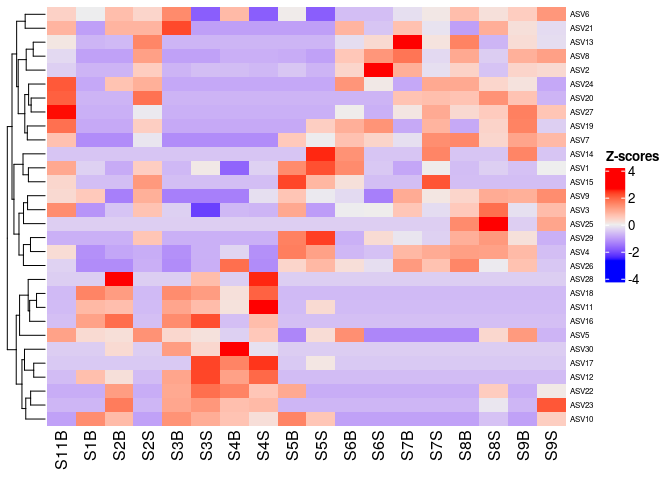<!-- -->

``` r
# récupérer le tableau taxonomique
taxon <- phyloseq::tax_table(selection30) |>
  as.data.frame()

#concatène ASV avec les phylums et les noms des familles
myname <- paste(rownames(taxon), taxon$Phylum, taxon$Family, sep="_")

#appliquer le tout
colnames(selection30_asv) <- myname
```

``` r
#re-run Z-score to take into account the colnames change
#refaire tourner l'algorithme du Z-score pour prendre en compte les noms changés des colonnes
heat <- t(scale(selection30_asv))

my_top_annotation <- ComplexHeatmap::anno_block(gp = grid::gpar(fill =c(3,4)),
                                               labels = c(1, 2),
                                               labels_gp = grid::gpar(col = "white",
                                                                      fontsize = 10))

ComplexHeatmap::Heatmap(
  heat,
  row_names_gp = grid::gpar(fontsize = 6),
  cluster_columns =TRUE,
  heatmap_legend_param = list(direction = "vertical",
   title ="Z-scores",
   grid_width = unit(0.5, "cm"),
   legend_height = unit(4, "cm")),
  top_annotation = ComplexHeatmap::HeatmapAnnotation(foo = my_top_annotation),
  column_km = 2,
  column_names_gp= grid::gpar(fontsize = 6)
  )
```

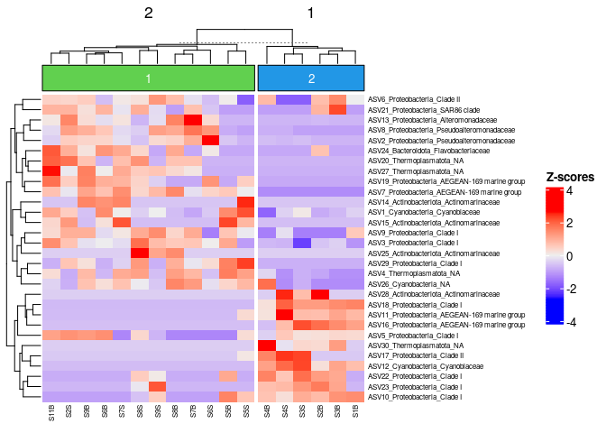<!-- -->

``` r
#ajouter un boxplot de distribution d'abondance d'ASV
boxplot <- ComplexHeatmap::anno_boxplot(t(selection30_asv), 
                                        which = "row",
                                        gp = grid::gpar(fill = "turquoise3"))

my_boxplot_left_anno <- ComplexHeatmap::HeatmapAnnotation(Abund = boxplot,
                                                          which = "row",
                                                          width = unit(3, "cm"))

my_top_anno <- ComplexHeatmap::anno_block(gp = grid::gpar(fill = c(3, 6)),
                                          labels = c("South", "North"),
                                          labels_gp = grid::gpar(col = "white",
                                                                fontsize = 10))

my_top_anno <- ComplexHeatmap::HeatmapAnnotation(foo = my_top_anno)

ComplexHeatmap::Heatmap(
  heat,
  row_names_gp = grid::gpar(fontsize = 7),
  left_annotation = my_boxplot_left_anno, 
  heatmap_legend_param = list(direction = "vertical",
                              title ="Z-scores",
                              grid_width = unit(0.5, "cm"),
                              legend_height = unit(3, "cm")),
  top_annotation = my_top_anno,
  column_km = 2,
  cluster_columns = TRUE,
  column_dend_side = "bottom",
  column_names_gp = grid::gpar(fontsize = 7)
  )
```

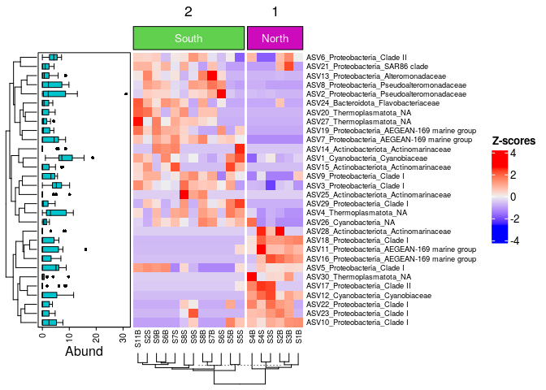<!-- -->

``` r
# on peut observer (un jour j'espère j'aimerai que ça fonctionne) que les communautés microbiennes dans les échantillons du sud diffèrent de celles du nord. L'effet significatif du traitement doit être testé statistiquement. la diff entre la composition des commu est due à l'abondance differentielle apparente de pleins des top ASV du dataset. L'identification des biomarqueurs significatifs des échantillons du nord et du sud seront recouverts(???) plus tard
```

\#partie 6 : indirect gradient analysis

``` r
#pendant que l'analyse des cluster cherche pour une discontinuité dans le dataset, l'ordination extrait la plus obvious tendance en forme d'axes continus.
#c'est bien adapté d'analyser les data depuis des communautés écologiques naturelles qui sont généralement structurées en gradient
#c'est pourquoi ces types d'analyses sont appelées des analyses gradientes. Le but de la méthode d'ordination c'est de représenter la data le long d'un nombre réduit d'axe orthogonaux, construits dans un sens où ils représentent dans un ordre décroissant la tendance la plus représent&e des data. On va voir 4 types d'analyses vue en écologie : PCA, PCoA, NMDS : toutes ces méthodes sont descriptives : aucun test stat est  fourni pour évaluer la signification des structures détectées. C'est le rôle des ordinations sous contraintes ou des analyses de test d'hypothèses qui sont présentées par la suite.
```

\#partie 6.1 : PCA

``` r
#PCA : principal component analysis : méthode pour résumé, dans un espace avec peu de dimension, la variance dans une dispersion mutivariée de points. Ca donne une vue sur les relations linéaires entre nos objets et nos variables. Ca peut souvent servir de bon point de départ dans l'analyse de data multivariées en nous permettant de faire une tendance, des groupes, des variables clées et des potentiels valeurs aberrantes. Ici on va utiliser la distance d'Aitchinson. Attention : c'est le tableau ASV CLR transformé  qu'on utilise directement, pas la matrice de distance Aitchinson. Cette fonction va calculer une distance euclidienne sur le tableau CLR transformé pour avoir la matrice Aitchinson. Il y a beaucoup de packages qui permettent l'analyse PCA. On va utilisé le PCAtools qui est récent et qui fourni les fonctions pour l'exploration des data par une PCA, et qui permet à l'utilisateur de générer des figures prêtes pour la publication 

#nombre de PC à retenir :
#prepare the ASV table to add taxonomy
tax_CLR <-  as.data.frame(tax_table(physeq_clr)) # get taxnomic table
#concatene ASV with Family & Genus names
ASVname <- paste(rownames(tax_CLR), tax_CLR$Family, tax_CLR$Genus,sep="_")
#apply 
rownames(physeq_clr_asv) <- ASVname
p <- PCAtools::pca(physeq_clr_asv,
                   metadata = data.frame(sample_data(physeq_clr)))
PCAtools::screeplot(p, axisLabSize = 18, titleLabSize = 22)
```

    ## Warning: Removed 2 rows containing missing values (`geom_line()`).

    ## Warning: Removed 2 rows containing missing values (`geom_point()`).

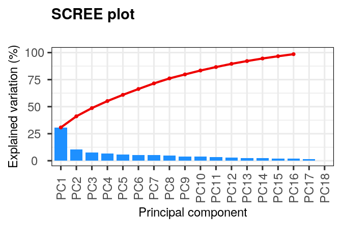<!-- -->

``` r
#on voit que chaque PC ressortent avec 31% de variance expliquée et après on a une diminution graduelle pour les composants qui restent. Un diagramme d'éboulis(??) tout seul montre juste la proportion cumulée d'une variation expliquée, mais on veut déterminer le nombre optimum de PC à retenir.

#Horn’s parallel analysis (Horn 1965) (Buja and Eyuboglu 1992)
horn <- PCAtools::parallelPCA(physeq_clr_asv)
```

    ## Warning in check_numbers(x, k = k, nu = nu, nv = nv): more singular
    ## values/vectors requested than available

    ## Warning in check_numbers(x, k = k, nu = nu, nv = nv): more singular
    ## values/vectors requested than available

    ## Warning in check_numbers(x, k = k, nu = nu, nv = nv): more singular
    ## values/vectors requested than available

    ## Warning in check_numbers(x, k = k, nu = nu, nv = nv): more singular
    ## values/vectors requested than available

    ## Warning in check_numbers(x, k = k, nu = nu, nv = nv): more singular
    ## values/vectors requested than available

    ## Warning in check_numbers(x, k = k, nu = nu, nv = nv): more singular
    ## values/vectors requested than available

    ## Warning in check_numbers(x, k = k, nu = nu, nv = nv): more singular
    ## values/vectors requested than available

    ## Warning in check_numbers(x, k = k, nu = nu, nv = nv): more singular
    ## values/vectors requested than available

    ## Warning in check_numbers(x, k = k, nu = nu, nv = nv): more singular
    ## values/vectors requested than available

    ## Warning in check_numbers(x, k = k, nu = nu, nv = nv): more singular
    ## values/vectors requested than available

    ## Warning in check_numbers(x, k = k, nu = nu, nv = nv): more singular
    ## values/vectors requested than available

    ## Warning in check_numbers(x, k = k, nu = nu, nv = nv): more singular
    ## values/vectors requested than available

    ## Warning in check_numbers(x, k = k, nu = nu, nv = nv): more singular
    ## values/vectors requested than available

    ## Warning in check_numbers(x, k = k, nu = nu, nv = nv): more singular
    ## values/vectors requested than available

    ## Warning in check_numbers(x, k = k, nu = nu, nv = nv): more singular
    ## values/vectors requested than available

    ## Warning in check_numbers(x, k = k, nu = nu, nv = nv): more singular
    ## values/vectors requested than available

    ## Warning in check_numbers(x, k = k, nu = nu, nv = nv): more singular
    ## values/vectors requested than available

    ## Warning in check_numbers(x, k = k, nu = nu, nv = nv): more singular
    ## values/vectors requested than available

    ## Warning in check_numbers(x, k = k, nu = nu, nv = nv): more singular
    ## values/vectors requested than available

    ## Warning in check_numbers(x, k = k, nu = nu, nv = nv): more singular
    ## values/vectors requested than available

    ## Warning in check_numbers(x, k = k, nu = nu, nv = nv): more singular
    ## values/vectors requested than available

    ## Warning in check_numbers(x, k = k, nu = nu, nv = nv): more singular
    ## values/vectors requested than available

    ## Warning in check_numbers(x, k = k, nu = nu, nv = nv): more singular
    ## values/vectors requested than available

    ## Warning in check_numbers(x, k = k, nu = nu, nv = nv): more singular
    ## values/vectors requested than available

    ## Warning in check_numbers(x, k = k, nu = nu, nv = nv): more singular
    ## values/vectors requested than available

    ## Warning in check_numbers(x, k = k, nu = nu, nv = nv): more singular
    ## values/vectors requested than available

    ## Warning in check_numbers(x, k = k, nu = nu, nv = nv): more singular
    ## values/vectors requested than available

    ## Warning in check_numbers(x, k = k, nu = nu, nv = nv): more singular
    ## values/vectors requested than available

    ## Warning in check_numbers(x, k = k, nu = nu, nv = nv): more singular
    ## values/vectors requested than available

    ## Warning in check_numbers(x, k = k, nu = nu, nv = nv): more singular
    ## values/vectors requested than available

    ## Warning in check_numbers(x, k = k, nu = nu, nv = nv): more singular
    ## values/vectors requested than available

    ## Warning in check_numbers(x, k = k, nu = nu, nv = nv): more singular
    ## values/vectors requested than available

    ## Warning in check_numbers(x, k = k, nu = nu, nv = nv): more singular
    ## values/vectors requested than available

    ## Warning in check_numbers(x, k = k, nu = nu, nv = nv): more singular
    ## values/vectors requested than available

    ## Warning in check_numbers(x, k = k, nu = nu, nv = nv): more singular
    ## values/vectors requested than available

    ## Warning in check_numbers(x, k = k, nu = nu, nv = nv): more singular
    ## values/vectors requested than available

    ## Warning in check_numbers(x, k = k, nu = nu, nv = nv): more singular
    ## values/vectors requested than available

    ## Warning in check_numbers(x, k = k, nu = nu, nv = nv): more singular
    ## values/vectors requested than available

    ## Warning in check_numbers(x, k = k, nu = nu, nv = nv): more singular
    ## values/vectors requested than available

    ## Warning in check_numbers(x, k = k, nu = nu, nv = nv): more singular
    ## values/vectors requested than available

    ## Warning in check_numbers(x, k = k, nu = nu, nv = nv): more singular
    ## values/vectors requested than available

    ## Warning in check_numbers(x, k = k, nu = nu, nv = nv): more singular
    ## values/vectors requested than available

    ## Warning in check_numbers(x, k = k, nu = nu, nv = nv): more singular
    ## values/vectors requested than available

    ## Warning in check_numbers(x, k = k, nu = nu, nv = nv): more singular
    ## values/vectors requested than available

    ## Warning in check_numbers(x, k = k, nu = nu, nv = nv): more singular
    ## values/vectors requested than available

    ## Warning in check_numbers(x, k = k, nu = nu, nv = nv): more singular
    ## values/vectors requested than available

    ## Warning in check_numbers(x, k = k, nu = nu, nv = nv): more singular
    ## values/vectors requested than available

    ## Warning in check_numbers(x, k = k, nu = nu, nv = nv): more singular
    ## values/vectors requested than available

    ## Warning in check_numbers(x, k = k, nu = nu, nv = nv): more singular
    ## values/vectors requested than available

    ## Warning in check_numbers(x, k = k, nu = nu, nv = nv): more singular
    ## values/vectors requested than available

    ## Warning in check_numbers(x, k = k, nu = nu, nv = nv): more singular
    ## values/vectors requested than available

``` r
horn$n
```

    ## [1] 2

``` r
#elbow method
elbow <- PCAtools::findElbowPoint(p$variance)
elbow
```

    ## PC3 
    ##   3

``` r
#les deux méthodes indiques qu'on doit retenir les 2 ou 3 premières PC. La raison de cette divergence c'est parce que trouver le nombre correct de PC c'est difficile et ça demande de trouver le bon nombre de clusters dans le dataset - y'a pas de bonne rep. la plupart des études prennent en compte que les deux premières PC
```

``` r
# mettre en plot l'ordination :
PCAtools::biplot(
  p,
  lab = p$metadata$SampName,
  colby = "Geo",
  pointSize = 5,
  hline = 0, vline = 0,
  legendPosition = "right"
)
```

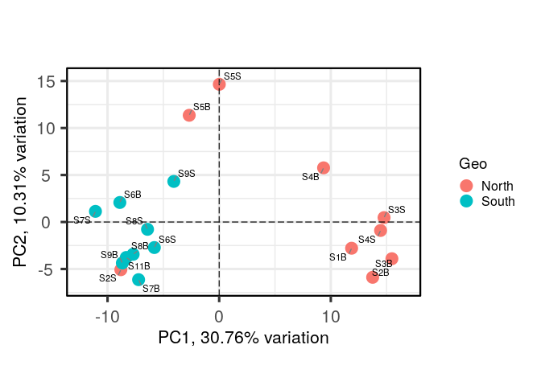<!-- -->

``` r
# chaque point est un échantillon, et les échantillons qui apparaissent proches sont plus probables d'être similaires que ceux qui sont loins (bienvu sherlock) -> en colorant les points par un traitement on peut voir que les microbes du nord est plus souvent, mais pas toujours, vachement différent des échantillons du sud
```

``` r
#déterminer les variables qui dirigent la variation dans chaque PC
# un des bénéfices à ne pas utiliser une matrice de distance, on peut faire un plot des "taxa loadings" sur nos axes PCA. PCAtools permet de ploter le nombre de vecteurs loading taxa avec lesquels on veut commencer qui ont le plus gros poids sur chaque PC. la taille relative de chaque vecteur loading idique sa contribution sur chaque axe de PCA montré, et permet d'estimer à peu près chaque echantillon qui contient plus que ce dit taxon

PCAtools::biplot(
  p, 
  # loadings parameters
  showLoadings = TRUE,
  lengthLoadingsArrowsFactor = 1.5,
  sizeLoadingsNames = 3,
  colLoadingsNames = 'red4',
  ntopLoadings = 3,
  # other parameters
  lab = p$metadata$X.SampleID,
  colby = "Geo",
  hline = 0, vline = 0,
  legendPosition = "right"
)
```

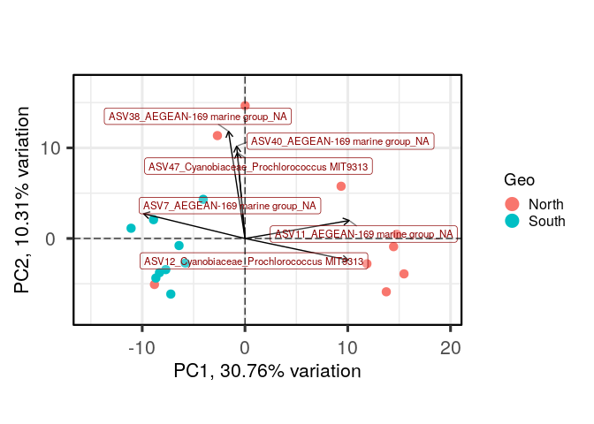<!-- -->

``` r
#ASV 7,11,12 ont une grosse contribution à PC1 tandis qui ASV 38, 40 et 47 ont une grosse contribution à PC2, ces ASV appartiennt à 2 familles. Les échantillons du sud contiennent une plus grande abondance de ASV11 et 12. Les deux échantillons aberrants du nord en haut du plot sont caractérises par une plus haute abondance de ASV38,40 et 47
```

``` r
#correler le principal composant à nos data envtale

PCAtools::eigencorplot(
  p,
  components = PCAtools::getComponents(p, 1:horn$n),
  metavars = c('SiOH4','NO2','NO3','NH4','PO4',
              'NT','PT','Chla',"T", "S", "Sigma_t"),
  col = c('white', 'cornsilk1', 'gold',
          'forestgreen', 'darkgreen'),
  cexCorval = 1.2,
  fontCorval = 2,
  posLab = "all",
  rotLabX = 45,
  scale = TRUE,
  main = bquote(PC ~ Spearman ~ r^2 ~ environmental ~ correlates),
  plotRsquared = TRUE,
  corFUN = "spearman",
  corUSE = "pairwise.complete.obs",
  corMultipleTestCorrection = 'BH',
  signifSymbols = c("****", "***", "**", "*", ""),
  signifCutpoints = c(0, 0.0001, 0.001, 0.01, 0.05, 1)
)
```

    ## Warning in cor.test.default(xvals[, i], yvals[, j], use = corUSE, method =
    ## corFUN): Cannot compute exact p-value with ties

    ## Warning in cor.test.default(xvals[, i], yvals[, j], use = corUSE, method =
    ## corFUN): Cannot compute exact p-value with ties

    ## Warning in cor.test.default(xvals[, i], yvals[, j], use = corUSE, method =
    ## corFUN): Cannot compute exact p-value with ties

    ## Warning in cor.test.default(xvals[, i], yvals[, j], use = corUSE, method =
    ## corFUN): Cannot compute exact p-value with ties

    ## Warning in cor.test.default(xvals[, i], yvals[, j], use = corUSE, method =
    ## corFUN): Cannot compute exact p-value with ties

    ## Warning in cor.test.default(xvals[, i], yvals[, j], use = corUSE, method =
    ## corFUN): Cannot compute exact p-value with ties

    ## Warning in cor.test.default(xvals[, i], yvals[, j], use = corUSE, method =
    ## corFUN): Cannot compute exact p-value with ties

    ## Warning in cor.test.default(xvals[, i], yvals[, j], use = corUSE, method =
    ## corFUN): Cannot compute exact p-value with ties

    ## Warning in cor.test.default(xvals[, i], yvals[, j], use = corUSE, method =
    ## corFUN): Cannot compute exact p-value with ties

    ## Warning in cor.test.default(xvals[, i], yvals[, j], use = corUSE, method =
    ## corFUN): Cannot compute exact p-value with ties

    ## Warning in cor.test.default(xvals[, i], yvals[, j], use = corUSE, method =
    ## corFUN): Cannot compute exact p-value with ties

    ## Warning in cor.test.default(xvals[, i], yvals[, j], use = corUSE, method =
    ## corFUN): Cannot compute exact p-value with ties

    ## Warning in cor.test.default(xvals[, i], yvals[, j], use = corUSE, method =
    ## corFUN): Cannot compute exact p-value with ties

    ## Warning in cor.test.default(xvals[, i], yvals[, j], use = corUSE, method =
    ## corFUN): Cannot compute exact p-value with ties

    ## Warning in cor.test.default(xvals[, i], yvals[, j], use = corUSE, method =
    ## corFUN): Cannot compute exact p-value with ties

    ## Warning in cor.test.default(xvals[, i], yvals[, j], use = corUSE, method =
    ## corFUN): Cannot compute exact p-value with ties

    ## Warning in cor.test.default(xvals[, i], yvals[, j], use = corUSE, method =
    ## corFUN): Cannot compute exact p-value with ties

    ## Warning in cor.test.default(xvals[, i], yvals[, j], use = corUSE, method =
    ## corFUN): Cannot compute exact p-value with ties

    ## Warning in cor.test.default(xvals[, i], yvals[, j], use = corUSE, method =
    ## corFUN): Cannot compute exact p-value with ties

    ## Warning in cor.test.default(xvals[, i], yvals[, j], use = corUSE, method =
    ## corFUN): Cannot compute exact p-value with ties

    ## Warning in cor.test.default(xvals[, i], yvals[, j], use = corUSE, method =
    ## corFUN): Cannot compute exact p-value with ties

    ## Warning in cor.test.default(xvals[, i], yvals[, j], use = corUSE, method =
    ## corFUN): Cannot compute exact p-value with ties

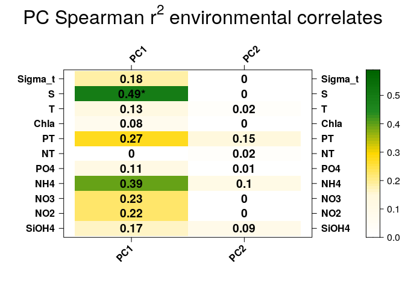<!-- -->

``` r
#la seule correlation significative trouvé entre PC1 expliqué par la séparation entre les échantillons du nord et du sud et la salinité. C'est interessant mais la correlation entre deux variables ne veut pas tout de suite dire que le changement dans une variable est la cause de changements dans l'autre. On verra plus tard si c'est une relation de cause à effet entre la salinité et la difference entre les deux lieux échantillonés.
```

\#partie 6.2 : PCoA : principal component analysis

``` r
#PCoA veut representer la distance entre les échantillons dans un espace euclidien avec peu de dimension, en particulier, ça maximise la correlation linéaire entre les ditances dans une matrice de distance, et les distances dans un espace avec peu de dimensions(tipiquement 2 ou 3 axes sont sélectionnés). Comme toujours le choix de mesure de (dis)similarité est critique et doit coller au data en question. Ici on utilise la distance de Bray-curtis. Quand la distance métrique est euclidienne, PCoA est équivalente à la PCA -> l'interpretation des résultats est la meme. 

#BPCoA on Bray-Curtis dissimilarity
pcoa_asv <- ape::pcoa(physeq_rar_bray)
pcoa_coord <- pcoa_asv$vectors[, 1:2]

#Data frame for hull
hull <- data.frame("Axis.1" = pcoa_coord[, 1],
                   "Axis.2" = pcoa_coord[, 2],
                   "sample" = as.data.frame(sample_data(physeq_rar@sam_data)))


# North <- hull[hull$sample.Geo  == "North", ][chull(hull[hull$sample.Geo ==  "North", c("Axis.1", "Axis.2")]), ]  # hull values for North
# South <- hull[hull$sample.Geo == "South", ][chull(hull[hull$sample.Geo == 
#                                                          "South", c("Axis.1", "Axis.2")]), ]  # hull values for Jellyfishes  

# hull_data <- rbind(North, South)

#Vector of color for hulls
# color <- rep("#a65628", length(hull_data$sample.Geo))
# color[hull_data$sample.Geo == "North"] <- "#1919ff"
# hull_data <- cbind(hull_data, color)

hull_col <- c("#a65628","#1919ff")
names(hull_col) <- c("North","South")

hull_data <- hull %>%
  dplyr::group_by(sample.Geo) %>%
  dplyr::slice(chull(Axis.1,Axis.2)) %>%
  dplyr::mutate(color = hull_col[sample.Geo])

head(hull_data)
```

    ## # A tibble: 6 × 24
    ## # Groups:   sample.Geo [1]
    ##     Axis.1  Axis.2 sample.SampName sample.Geo sample.Description sample.groupe
    ##      <dbl>   <dbl> <chr>           <chr>      <chr>              <chr>        
    ## 1  0.242   -0.0992 S2S             North      North2S            NBS          
    ## 2 -0.403   -0.130  S2B             North      North2B            NBF          
    ## 3 -0.455   -0.0922 S3B             North      North3B            NBF          
    ## 4 -0.471    0.0176 S3S             North      North3S            NBS          
    ## 5  0.00454  0.407  S5S             North      North5S            NBS          
    ## 6  0.102    0.327  S5B             North      North5B            NBF          
    ## # ℹ 18 more variables: sample.Pres <int>, sample.PicoEuk <int>,
    ## #   sample.Synec <int>, sample.Prochloro <int>, sample.NanoEuk <int>,
    ## #   sample.Crypto <int>, sample.SiOH4 <dbl>, sample.NO2 <dbl>,
    ## #   sample.NO3 <dbl>, sample.NH4 <dbl>, sample.PO4 <dbl>, sample.NT <dbl>,
    ## #   sample.PT <dbl>, sample.Chla <dbl>, sample.T <dbl>, sample.S <dbl>,
    ## #   sample.Sigma_t <dbl>, color <chr>

``` r
ggplot(data = hull, aes(x = Axis.1, y = Axis.2)) +
  geom_hline(yintercept = 0, colour = "lightgrey", linetype = 2) +
  geom_vline(xintercept = 0, colour = "lightgrey", linetype = 2) +
  geom_polygon(data = hull_data,
               aes(group = sample.Geo,
                   fill = sample.Geo),
               alpha = 0.3) + # add the convex hulls)
  scale_fill_manual(values = c("Darkgrey", "#1919ff")) +
  geom_point(data = hull,
             aes(color = sample.Geo,
                 size = sample.S),
             alpha = 0.7) +
  scale_color_manual(values = c("Darkgrey", "#1919ff")) +
  xlab(paste("PCo1 (", round(pcoa_asv$values$Relative_eig[1]*100, 1), "%)")) +
  ylab(paste("PCo2 (", round(pcoa_asv$values$Relative_eig[2]*100, 1), "%)")) +
  theme_bw() +
  coord_equal() +
  theme(axis.title.x = element_text(size = 14), # remove x-axis labels
        axis.title.y = element_text(size = 14), # remove y-axis labels
        panel.background = element_blank(), 
        panel.grid.major = element_blank(),  #remove major-grid labels
        panel.grid.minor = element_blank(),  #remove minor-grid labels
        plot.background = element_blank())
```

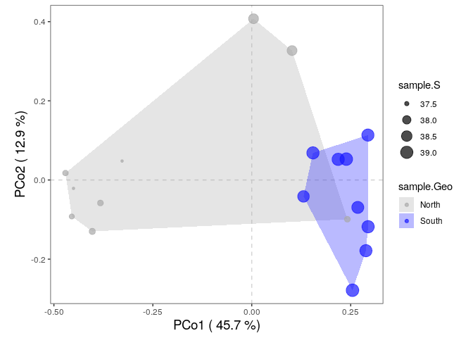<!-- -->

``` r
#l'odination des échantillons dans PCoA est très similaire de celle observée dans PCA avec une ségrégation claire entre le nord et le sud. Cela vient de la salinité qui augmente du nord au sud mais ça doit encore etre testé

#y'a pas d'espèces dans cette ordination, c'est parce qu'on a utilisé une matrice de dissimilarité pour que la fonction PCoA se fasse -> donc on peut pas calculer de score de spéciation. par contre on peut travailler sur ce problème avec la fonction biplot.pcoa() du package ape

#PCoA souffre d'un nombre de défauts, surtout sur l'effet d'arc. ces défauts viennent du fait que PCoA maximise la correlation linéaire. Le NMDS rectifie ça par maximiser la correlation de l'ordre de classement.
```

\#partie 6.3 : NMDS : non metric multidimensional scaling

``` r
#ça veut représenter la dissimilarité par paire entre les objets dans un espace à peu de dimensions. chaque coeficient de dissimilarité ou mesure de ditance peut etre utilisé pour constuire une matrice de distance comme entrée. C'est une approche basée sur le classement.Cela veut dire que la data de distance originelle est substituée par des classements. Pendant que l'info sur la magnitude des distances est perdue, les méthodes basées sur le classement est généralement plus robuste sur les data qui n'ont pas de distribution identifiable.

# NMDS est un algo iteratif, il commence par un placement aléatoire des objets dans un espace d'ordination. L'algo commence par affiner ce placement par un process iteratif, pour essayer de trouver une ordination qui ordonne la distance des objets aussi proche que possible de leur vrai distance de dissimilarité (vue dans l'originale matrice de distance). La valeur de stress montre à quel point l'ordination résume la distance observée entre les échantillons.
#ce n'est pas une analyse propre, ça a trois conséquences :
#il n'y a pas de résultat d'ordination unique
#les axes d'ordination ne sont pas ordonés à la variance qu'ils expliquent
# le nbr de dimensions de l'espace à peu de dimension doit être spécifié avant de faire l'analyse
# les axes ne sont pas ordonés avec le NMDS, vegan::metaMDS() rotationne automatiquement le résultat final en utilisant PCA pour faire correspondre l'axe 1 à la plus grande variance des points d'échantillons du NMDS

#NMDS plot on Aitchison distance
physeq_clr_nmds <- vegan::metaMDS(physeq_clr_dist, k=2, trymax=100) #Aitchison distance
```

    ## Run 0 stress 0.06963252 
    ## Run 1 stress 0.06963252 
    ## ... New best solution
    ## ... Procrustes: rmse 3.519632e-06  max resid 6.819366e-06 
    ## ... Similar to previous best
    ## Run 2 stress 0.08705507 
    ## Run 3 stress 0.06963252 
    ## ... Procrustes: rmse 1.984082e-06  max resid 3.686583e-06 
    ## ... Similar to previous best
    ## Run 4 stress 0.08747761 
    ## Run 5 stress 0.08909908 
    ## Run 6 stress 0.06963252 
    ## ... Procrustes: rmse 4.436839e-06  max resid 9.114362e-06 
    ## ... Similar to previous best
    ## Run 7 stress 0.06963252 
    ## ... Procrustes: rmse 2.967907e-06  max resid 6.047389e-06 
    ## ... Similar to previous best
    ## Run 8 stress 0.08747757 
    ## Run 9 stress 0.06963252 
    ## ... Procrustes: rmse 9.883376e-07  max resid 2.056696e-06 
    ## ... Similar to previous best
    ## Run 10 stress 0.06963252 
    ## ... Procrustes: rmse 5.333631e-07  max resid 1.187664e-06 
    ## ... Similar to previous best
    ## Run 11 stress 0.06963252 
    ## ... Procrustes: rmse 2.401433e-06  max resid 4.837389e-06 
    ## ... Similar to previous best
    ## Run 12 stress 0.08747757 
    ## Run 13 stress 0.06963252 
    ## ... Procrustes: rmse 1.821518e-06  max resid 3.14952e-06 
    ## ... Similar to previous best
    ## Run 14 stress 0.06963252 
    ## ... Procrustes: rmse 3.91536e-06  max resid 7.684323e-06 
    ## ... Similar to previous best
    ## Run 15 stress 0.08909787 
    ## Run 16 stress 0.06963252 
    ## ... Procrustes: rmse 3.690599e-06  max resid 7.475907e-06 
    ## ... Similar to previous best
    ## Run 17 stress 0.06963252 
    ## ... Procrustes: rmse 2.399131e-06  max resid 4.89376e-06 
    ## ... Similar to previous best
    ## Run 18 stress 0.06963252 
    ## ... Procrustes: rmse 7.790933e-06  max resid 1.562559e-05 
    ## ... Similar to previous best
    ## Run 19 stress 0.06963252 
    ## ... Procrustes: rmse 1.300643e-06  max resid 2.74642e-06 
    ## ... Similar to previous best
    ## Run 20 stress 0.08705507 
    ## *** Best solution repeated 13 times

``` r
#Un moyen utile d’évaluer la pertinence d’un résultat NMDS est de comparer dans un shepard diagram les distances entre les objets dans un plot d'orination avec les distances originelles
vegan::stressplot(physeq_clr_nmds)
```

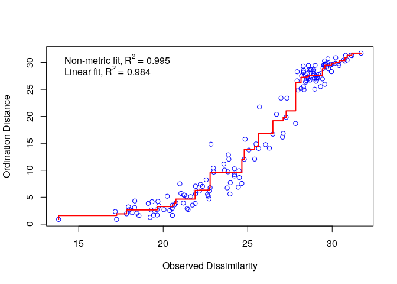<!-- -->

``` r
# il existe un bon ajustement non métrique entre les dissimilarités observées (dans notre matrice de distance) et les distances dans l'espace d'ordination. Aussi le stress de notre résultat final est bon.

#la valeur stress peut être utilisée comme un indicateur de bon ajustement. Quand la valeur de stress est >0.2 c'est que c'est pauvre et souvent non interprétable, alors que les valeurs <0.1 sont bonnes et les <0.05 sont excellentes, ce qui laisse un mini danger de mauvais interpretation
#on peut plot le résultat :
nmds_coord <- data.frame(physeq_clr_nmds$points)

#Data frame for hull
hull <- data.frame("Axis.1" = nmds_coord[,1],
                   "Axis.2" = nmds_coord[,2],
                   "sample" = as.data.frame(sample_data(physeq_clr@sam_data)))

# North <- hull[hull$sample.Geo  == "North", ][chull(hull[hull$sample.Geo == 
#                                                                 "North", c("Axis.1", "Axis.2")]), ]  # hull values for North
# South <- hull[hull$sample.Geo == "South", ][chull(hull[hull$sample.Geo == 
#                                                                "South", c("Axis.1", "Axis.2")]), ]  # hull values for Jellyfishes  

# hull_data <- rbind(North, South)

# #Vector of color for hulls
# color <- rep("#a65628", length(hull_data$sample.Geo))
# color[hull_data$sample.Geo == "North"] <- "#1919ff"
# hull_data <- cbind(hull_data, color)

hull_col <- c("#a65628","#1919ff")
names(hull_col) <- c("North","South")

hull_data <- hull %>%
  dplyr::group_by(sample.Geo) %>%
  dplyr::slice(chull(Axis.1,Axis.2)) %>%
  dplyr::mutate(color = hull_col[sample.Geo])

#pdf(file="NMDS_Aitchison.pdf", wi = 7, he = 7)
ggplot(hull,aes(x = Axis.1, y = Axis.2)) +
  geom_hline(yintercept = 0, colour = "lightgrey", linetype = 2) + 
  geom_vline(xintercept = 0, colour = "lightgrey", linetype = 2) +
  geom_polygon(data = hull_data,
               aes(group = sample.Geo,
                   fill = sample.Geo),
               alpha = 0.3) + # add the convex hulls)
  scale_fill_manual(values = c("Darkgrey", "#1919ff")) +
  geom_point(data = hull,
             aes(color = sample.Geo,
                 size = sample.S),
             alpha = 0.7) +
  scale_color_manual(values = c("Darkgrey", "#1919ff")) +
  geom_text(data = hull_data,
            x = -0, y = -9,
            label = paste("Stress =", round(physeq_clr_nmds$stress, 2)),
            colour = "Black",
            size = 5)  +
  xlab(paste("MDS1")) +
  ylab(paste("MDS2")) +
  theme_bw() +
  coord_equal() +
  theme(axis.title.x = element_text(size=14), # remove x-axis labels
        axis.title.y = element_text(size=14), # remove y-axis labels
        panel.background = element_blank(), 
        panel.grid.major = element_blank(),  #remove major-grid labels
        panel.grid.minor = element_blank(),  #remove minor-grid labels
        plot.background = element_blank())
```

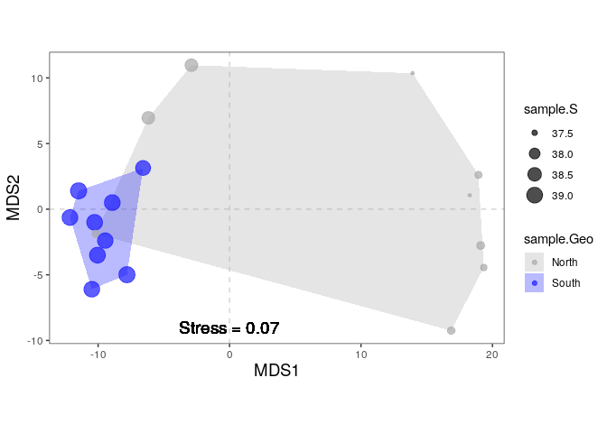<!-- -->

``` r
#on observe le même pattern d'ordination des échantillons comme avec PCA et PCoA. Il n'y a pas de score d'espèce (le même problème avec PCoA) on peut régler ce problème en utilisant la fonction wascores qui donne metaMDS la matrice de commu originelle comme entrée et qui spécifie une mesure de distance
```

``` r
#quelles variable envtale drive les differences observées dans la compo des sp ? comme on a fait avec PCA, on peut correler les variables envtales avec nos axes d'ordination

# Correlation with environmental data
data.frame(names(hull))
```

    ##           names.hull.
    ## 1              Axis.1
    ## 2              Axis.2
    ## 3     sample.SampName
    ## 4          sample.Geo
    ## 5  sample.Description
    ## 6       sample.groupe
    ## 7         sample.Pres
    ## 8      sample.PicoEuk
    ## 9        sample.Synec
    ## 10   sample.Prochloro
    ## 11     sample.NanoEuk
    ## 12      sample.Crypto
    ## 13       sample.SiOH4
    ## 14         sample.NO2
    ## 15         sample.NO3
    ## 16         sample.NH4
    ## 17         sample.PO4
    ## 18          sample.NT
    ## 19          sample.PT
    ## 20        sample.Chla
    ## 21           sample.T
    ## 22           sample.S
    ## 23     sample.Sigma_t

``` r
env <- hull[, 13:23]

# The function envfit will add the environmental variables as vectors to the ordination plot
ef <- vegan::envfit(physeq_clr_nmds, env, permu = 1000)
ef
```

    ## 
    ## ***VECTORS
    ## 
    ##                   NMDS1    NMDS2     r2   Pr(>r)    
    ## sample.SiOH4   -0.95409 -0.29952 0.2717 0.102897    
    ## sample.NO2     -0.44259 -0.89672 0.3271 0.062937 .  
    ## sample.NO3      0.94086  0.33880 0.2986 0.069930 .  
    ## sample.NH4     -0.48808 -0.87280 0.4484 0.018981 *  
    ## sample.PO4     -0.67398 -0.73875 0.2498 0.099900 .  
    ## sample.NT       0.02371 -0.99972 0.0526 0.688312    
    ## sample.PT      -0.61900 -0.78539 0.3745 0.035964 *  
    ## sample.Chla    -0.96843 -0.24930 0.2016 0.192807    
    ## sample.T       -0.87263 -0.48838 0.3250 0.051948 .  
    ## sample.S       -0.93218 -0.36199 0.7607 0.000999 ***
    ## sample.Sigma_t -0.96163 -0.27437 0.2116 0.205794    
    ## ---
    ## Signif. codes:  0 '***' 0.001 '**' 0.01 '*' 0.05 '.' 0.1 ' ' 1
    ## Permutation: free
    ## Number of permutations: 1000

``` r
# The two last columns are of interest: the squared correlation coefficient and the associated p-value
# Plot the vectors of the significant correlations and interpret the plot
plot(physeq_clr_nmds, type = "t", display = "sites")
plot(ef, p.max = 0.05)
```

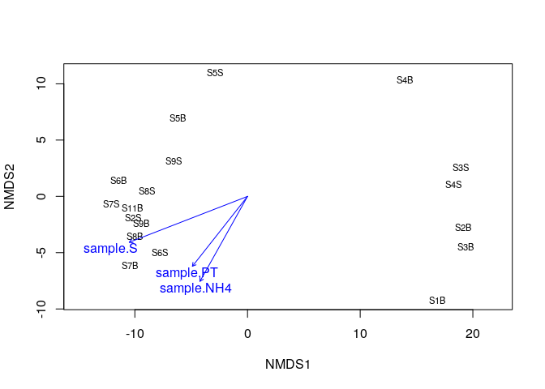<!-- -->

``` r
#ici on peut voir que la salinité est très correlée avec le premier axe qui sépare les échantillons du nord et du sud
#dans une moindre mesure, les nouvelles variables envtale related avec les conditions trophiques des habitats (NH4 et PT) sont correlés avec le deuxième axe de NMDS. La détection de ces nouvelles relations entre les commu microbiennes et l'envt peut etre related au fait que NMDS est le mieux adapté pour détecter la réponse non linéaire des microbes aux gradients envtaux.

#plusieurs types diff d'analyse de gradient peuvent se faire -> graphe 
```

\#partie 7 : analyses pour tester nos hypothèses

``` r
#on va tester si les cluster d'échantillons se regroupent au delà de ce qui est attendu en utilisant des méthodes de test d'hypo comme PERMANOVA (multivariate analysis of variane with permutation) et l'analyse des groupes de similarité (ANOSIM) multiresponse permutation procedures (MRPP) et le test de Mantel (MANTEL) et plus récemment Dirichlet-multinomial models.
```

``` r
# PERMANOVA : permet d'appliquer ANOVA à un dataset écologique multivarié. C'est le plus utilisé comme méthode non-paramétrique pour fiter les modèles multivariés à une data de microbes. C'est une analyse multivariée de variance basé sur les matrices de distances et la permutation. Ca se fait en utilisant le concept de centroides. plusieurs permutations de la data (random shuffling) est utilisé pour générer une distribution nulle. On va pouvoir évaluer si la groupe du nord ou du sud à un effet significatif sur la compo globale de la commu bactérienne.

#PERMANOVA
metadata <- data.frame(sample_data(physeq_clr))
results_permanova <- vegan::adonis2(physeq_clr_dist ~ Geo,
                                    data = metadata,
                                    perm = 1000)

results_permanova
```

    ## Permutation test for adonis under reduced model
    ## Terms added sequentially (first to last)
    ## Permutation: free
    ## Number of permutations: 1000
    ## 
    ## vegan::adonis2(formula = physeq_clr_dist ~ Geo, data = metadata, permutations = 1000)
    ##          Df SumOfSqs      R2      F   Pr(>F)   
    ## Geo       1   1135.5 0.20329 4.0825 0.001998 **
    ## Residual 16   4450.1 0.79671                   
    ## Total    17   5585.6 1.00000                   
    ## ---
    ## Signif. codes:  0 '***' 0.001 '**' 0.01 '*' 0.05 '.' 0.1 ' ' 1

``` r
#on voit que les regroupements nord et sud expliquent significativement (p<0.001) 20% de la variance dans la matrice ASV Aitchison. du coup, les deux groupes diffèrent significativement dans leur compo bac. 
```

``` r
#Le test d'ADONIS peut être perturbé par des diff de dispersion (ou de propagation), nous voulons donc vérifier ça.

# Testing the assumption of similar multivariate spread among the groups (ie. analogous to variance homogeneity)
anova(vegan::betadisper(physeq_clr_dist, metadata$Geo))
```

    ## Analysis of Variance Table
    ## 
    ## Response: Distances
    ##           Df Sum Sq Mean Sq F value   Pr(>F)   
    ## Groups     1 49.657  49.657  13.915 0.001822 **
    ## Residuals 16 57.096   3.569                    
    ## ---
    ## Signif. codes:  0 '***' 0.001 '**' 0.01 '*' 0.05 '.' 0.1 ' ' 1

``` r
# ici les groupes ont des diff de dispersion significatives et le résultat de la permanova peut être impacté par ça, bien que permanova est très robuste pour différencier les dispersion des groupes
```

``` r
#onpeut regarder quel taxa contribue le plus à la diff de commu en utilisant l'ancienne fonction adonis() et la table des ASV des comptes transformés CLR. 

#Show coefficients for the top taxa separating the groups

permanova <- vegan::adonis(t(physeq_clr_asv) ~ Geo,
                            data = metadata,
                            permutations = 1000,
                            method = "euclidean")
```

    ## 'adonis' will be deprecated: use 'adonis2' instead

``` r
coef <- coefficients(permanova)["Geo1",]

top.coef <- coef[rev(order(abs(coef)))[1:10]]

par(mar = c(3, 14, 2, 1))

barplot(sort(top.coef),
        horiz = TRUE,
        las = 1,
        main = "Top taxa",
        cex.names = 0.7)
```

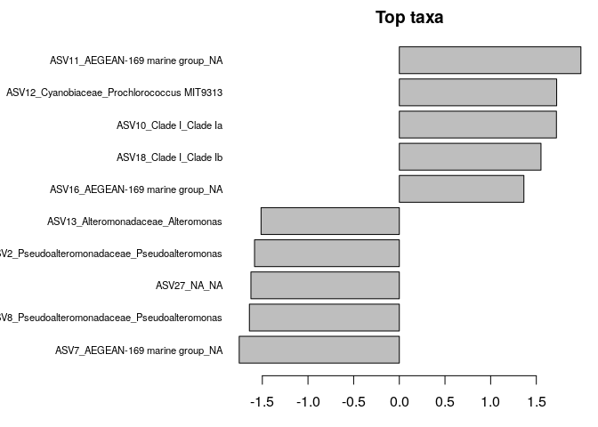<!-- -->

``` r
#adonis() et adonis2() nous permet d'explorer les effets des catégories ou des variables continues

# une diff importante entre ces deux fonctions : les termes avec adonis sont testés séquentiellement et c'est la seule option. Cela veut dire que l'ordre dans lequel on entre nos variables est important (si le design est non balancés). Le prochain est ajouté pour voir si ça explique de manière significative plus de variation non expliquées par les variables d'avant. c'est l'équivalent d'utiliser by="terms" dans adonis2(). Si tu ne veux pas que l'ordre compte on peut utiliser adonis2 avec by="margin", ou alors si on veut voir si le modèle en entier est signif on peut utiliser by=NULL. L'ordre on s'en fiche quand by="margin" parce que la signification est testé contre un modèle qui inclue toutes les autres variables pas juste celles qui précèdent dans la formule.

#Permanova on continuous variables
permanova_S <- vegan::adonis2(physeq_clr_dist ~ S,
                              data = metadata,
                              perm = 1000)
permanova_S
```

    ## Permutation test for adonis under reduced model
    ## Terms added sequentially (first to last)
    ## Permutation: free
    ## Number of permutations: 1000
    ## 
    ## vegan::adonis2(formula = physeq_clr_dist ~ S, data = metadata, permutations = 1000)
    ##          Df SumOfSqs      R2      F   Pr(>F)    
    ## S         1   1294.1 0.23168 4.8247 0.000999 ***
    ## Residual 16   4291.5 0.76832                    
    ## Total    17   5585.6 1.00000                    
    ## ---
    ## Signif. codes:  0 '***' 0.001 '**' 0.01 '*' 0.05 '.' 0.1 ' ' 1

``` r
permanova_NH4 <- vegan::adonis2(physeq_clr_dist ~ NH4,
                                data = metadata,
                                perm = 1000)
permanova_NH4
```

    ## Permutation test for adonis under reduced model
    ## Terms added sequentially (first to last)
    ## Permutation: free
    ## Number of permutations: 1000
    ## 
    ## vegan::adonis2(formula = physeq_clr_dist ~ NH4, data = metadata, permutations = 1000)
    ##          Df SumOfSqs      R2      F  Pr(>F)  
    ## NH4       1    769.8 0.13782 2.5575 0.01598 *
    ## Residual 16   4815.8 0.86218                 
    ## Total    17   5585.6 1.00000                 
    ## ---
    ## Signif. codes:  0 '***' 0.001 '**' 0.01 '*' 0.05 '.' 0.1 ' ' 1

``` r
permanova_PT <- vegan::adonis2(physeq_clr_dist ~ PT,
                               data = metadata,
                               perm = 1000)
permanova_PT
```

    ## Permutation test for adonis under reduced model
    ## Terms added sequentially (first to last)
    ## Permutation: free
    ## Number of permutations: 1000
    ## 
    ## vegan::adonis2(formula = physeq_clr_dist ~ PT, data = metadata, permutations = 1000)
    ##          Df SumOfSqs      R2      F  Pr(>F)  
    ## PT        1    697.3 0.12483 2.2822 0.01898 *
    ## Residual 16   4888.3 0.87517                 
    ## Total    17   5585.6 1.00000                 
    ## ---
    ## Signif. codes:  0 '***' 0.001 '**' 0.01 '*' 0.05 '.' 0.1 ' ' 1

``` r
#le résultat confirme que la salinité et à moindre mesure le NH4 et le PT sont d'importants facteurs qui caractérisent les commu microbiennes mais qu'en est-il des autres variables ? on va construire un modèle avec toutes les co-variables

#Inspecting co-variables
permanova_all <- vegan::adonis2(physeq_clr_dist ~ SiOH4 + NO2 + NO3 + NH4 + PO4 + NT + PT + Chla + T + S + Sigma_t,
                                by="margin",
                                data=metadata,
                                perm=1000)

permanova_all
```

    ## Permutation test for adonis under reduced model
    ## Marginal effects of terms
    ## Permutation: free
    ## Number of permutations: 1000
    ## 
    ## vegan::adonis2(formula = physeq_clr_dist ~ SiOH4 + NO2 + NO3 + NH4 + PO4 + NT + PT + Chla + T + S + Sigma_t, data = metadata, permutations = 1000, by = "margin")
    ##          Df SumOfSqs      R2      F Pr(>F)
    ## SiOH4     1    291.5 0.05219 1.0594 0.3217
    ## NO2       1    243.4 0.04357 0.8846 0.5425
    ## NO3       1    239.8 0.04293 0.8715 0.5634
    ## NH4       1    253.2 0.04533 0.9203 0.5145
    ## PO4       1    232.7 0.04165 0.8456 0.5914
    ## NT        1    234.6 0.04200 0.8527 0.6034
    ## PT        1    234.9 0.04206 0.8539 0.5734
    ## Chla      1    200.8 0.03594 0.7296 0.7692
    ## T         1    285.9 0.05118 1.0390 0.3856
    ## S         1    286.2 0.05124 1.0402 0.3816
    ## Sigma_t   1    285.3 0.05108 1.0370 0.3896
    ## Residual  6   1650.8 0.29555              
    ## Total    17   5585.6 1.00000

``` r
#pourquoi aucune des variables n'a plus d'effets signifs mtn ?
#on a du mal à ne pas construire un modèle pour prendre tout en compte. Bcp de temps et d'argent sont dépensés là dedans. on espère aussi identifié toutes les variables signifs pour encore mieux caractériser les relations avec une pertinence biologique. Une correlation excessive entre les variables explicatives peut compliquer ou prévenir l'identification d'un set optimal de variables explicatives pour un modèle stat.
```

``` r
#on regarde quelles varaibles explicatives sont correlées :

# inpecting autocorrélation
# compute the correlation matrix
cor_metadadata <- cor(metadata[, 11:21], method = "spearman")

cor_mtest <- function(mat, ...) {
  mat <- as.matrix(mat)
  n <- ncol(mat)
  p_mat <- matrix(NA, n, n)
  diag(p_mat) <- 0
  for (i in 1:(n - 1)) {
    for (j in (i + 1):n) {
      tmp <- cor.test(mat[, i], mat[, j], method = "spearman", ...)
      p_mat[i, j] <- p_mat[j, i] <- tmp$p.value
    }
  }
  colnames(p_mat) <- rownames(p_mat) <- colnames(mat)
  p_mat
}

# matrix of the p-value of the correlation
p_mat <- cor_mtest(metadata[, 11:21])
```

    ## Warning in cor.test.default(mat[, i], mat[, j], method = "spearman", ...):
    ## Cannot compute exact p-value with ties

    ## Warning in cor.test.default(mat[, i], mat[, j], method = "spearman", ...):
    ## Cannot compute exact p-value with ties

    ## Warning in cor.test.default(mat[, i], mat[, j], method = "spearman", ...):
    ## Cannot compute exact p-value with ties

    ## Warning in cor.test.default(mat[, i], mat[, j], method = "spearman", ...):
    ## Cannot compute exact p-value with ties

    ## Warning in cor.test.default(mat[, i], mat[, j], method = "spearman", ...):
    ## Cannot compute exact p-value with ties

    ## Warning in cor.test.default(mat[, i], mat[, j], method = "spearman", ...):
    ## Cannot compute exact p-value with ties

    ## Warning in cor.test.default(mat[, i], mat[, j], method = "spearman", ...):
    ## Cannot compute exact p-value with ties

    ## Warning in cor.test.default(mat[, i], mat[, j], method = "spearman", ...):
    ## Cannot compute exact p-value with ties

    ## Warning in cor.test.default(mat[, i], mat[, j], method = "spearman", ...):
    ## Cannot compute exact p-value with ties

    ## Warning in cor.test.default(mat[, i], mat[, j], method = "spearman", ...):
    ## Cannot compute exact p-value with ties

    ## Warning in cor.test.default(mat[, i], mat[, j], method = "spearman", ...):
    ## Cannot compute exact p-value with ties

    ## Warning in cor.test.default(mat[, i], mat[, j], method = "spearman", ...):
    ## Cannot compute exact p-value with ties

    ## Warning in cor.test.default(mat[, i], mat[, j], method = "spearman", ...):
    ## Cannot compute exact p-value with ties

    ## Warning in cor.test.default(mat[, i], mat[, j], method = "spearman", ...):
    ## Cannot compute exact p-value with ties

    ## Warning in cor.test.default(mat[, i], mat[, j], method = "spearman", ...):
    ## Cannot compute exact p-value with ties

    ## Warning in cor.test.default(mat[, i], mat[, j], method = "spearman", ...):
    ## Cannot compute exact p-value with ties

    ## Warning in cor.test.default(mat[, i], mat[, j], method = "spearman", ...):
    ## Cannot compute exact p-value with ties

    ## Warning in cor.test.default(mat[, i], mat[, j], method = "spearman", ...):
    ## Cannot compute exact p-value with ties

    ## Warning in cor.test.default(mat[, i], mat[, j], method = "spearman", ...):
    ## Cannot compute exact p-value with ties

    ## Warning in cor.test.default(mat[, i], mat[, j], method = "spearman", ...):
    ## Cannot compute exact p-value with ties

    ## Warning in cor.test.default(mat[, i], mat[, j], method = "spearman", ...):
    ## Cannot compute exact p-value with ties

    ## Warning in cor.test.default(mat[, i], mat[, j], method = "spearman", ...):
    ## Cannot compute exact p-value with ties

    ## Warning in cor.test.default(mat[, i], mat[, j], method = "spearman", ...):
    ## Cannot compute exact p-value with ties

    ## Warning in cor.test.default(mat[, i], mat[, j], method = "spearman", ...):
    ## Cannot compute exact p-value with ties

    ## Warning in cor.test.default(mat[, i], mat[, j], method = "spearman", ...):
    ## Cannot compute exact p-value with ties

    ## Warning in cor.test.default(mat[, i], mat[, j], method = "spearman", ...):
    ## Cannot compute exact p-value with ties

    ## Warning in cor.test.default(mat[, i], mat[, j], method = "spearman", ...):
    ## Cannot compute exact p-value with ties

    ## Warning in cor.test.default(mat[, i], mat[, j], method = "spearman", ...):
    ## Cannot compute exact p-value with ties

    ## Warning in cor.test.default(mat[, i], mat[, j], method = "spearman", ...):
    ## Cannot compute exact p-value with ties

    ## Warning in cor.test.default(mat[, i], mat[, j], method = "spearman", ...):
    ## Cannot compute exact p-value with ties

    ## Warning in cor.test.default(mat[, i], mat[, j], method = "spearman", ...):
    ## Cannot compute exact p-value with ties

    ## Warning in cor.test.default(mat[, i], mat[, j], method = "spearman", ...):
    ## Cannot compute exact p-value with ties

    ## Warning in cor.test.default(mat[, i], mat[, j], method = "spearman", ...):
    ## Cannot compute exact p-value with ties

    ## Warning in cor.test.default(mat[, i], mat[, j], method = "spearman", ...):
    ## Cannot compute exact p-value with ties

    ## Warning in cor.test.default(mat[, i], mat[, j], method = "spearman", ...):
    ## Cannot compute exact p-value with ties

    ## Warning in cor.test.default(mat[, i], mat[, j], method = "spearman", ...):
    ## Cannot compute exact p-value with ties

    ## Warning in cor.test.default(mat[, i], mat[, j], method = "spearman", ...):
    ## Cannot compute exact p-value with ties

    ## Warning in cor.test.default(mat[, i], mat[, j], method = "spearman", ...):
    ## Cannot compute exact p-value with ties

    ## Warning in cor.test.default(mat[, i], mat[, j], method = "spearman", ...):
    ## Cannot compute exact p-value with ties

    ## Warning in cor.test.default(mat[, i], mat[, j], method = "spearman", ...):
    ## Cannot compute exact p-value with ties

    ## Warning in cor.test.default(mat[, i], mat[, j], method = "spearman", ...):
    ## Cannot compute exact p-value with ties

    ## Warning in cor.test.default(mat[, i], mat[, j], method = "spearman", ...):
    ## Cannot compute exact p-value with ties

    ## Warning in cor.test.default(mat[, i], mat[, j], method = "spearman", ...):
    ## Cannot compute exact p-value with ties

    ## Warning in cor.test.default(mat[, i], mat[, j], method = "spearman", ...):
    ## Cannot compute exact p-value with ties

    ## Warning in cor.test.default(mat[, i], mat[, j], method = "spearman", ...):
    ## Cannot compute exact p-value with ties

    ## Warning in cor.test.default(mat[, i], mat[, j], method = "spearman", ...):
    ## Cannot compute exact p-value with ties

    ## Warning in cor.test.default(mat[, i], mat[, j], method = "spearman", ...):
    ## Cannot compute exact p-value with ties

    ## Warning in cor.test.default(mat[, i], mat[, j], method = "spearman", ...):
    ## Cannot compute exact p-value with ties

    ## Warning in cor.test.default(mat[, i], mat[, j], method = "spearman", ...):
    ## Cannot compute exact p-value with ties

    ## Warning in cor.test.default(mat[, i], mat[, j], method = "spearman", ...):
    ## Cannot compute exact p-value with ties

    ## Warning in cor.test.default(mat[, i], mat[, j], method = "spearman", ...):
    ## Cannot compute exact p-value with ties

    ## Warning in cor.test.default(mat[, i], mat[, j], method = "spearman", ...):
    ## Cannot compute exact p-value with ties

    ## Warning in cor.test.default(mat[, i], mat[, j], method = "spearman", ...):
    ## Cannot compute exact p-value with ties

    ## Warning in cor.test.default(mat[, i], mat[, j], method = "spearman", ...):
    ## Cannot compute exact p-value with ties

    ## Warning in cor.test.default(mat[, i], mat[, j], method = "spearman", ...):
    ## Cannot compute exact p-value with ties

``` r
# Leave blank on no significant coefficient
corrplot::corrplot(cor_metadadata,
                   type = "upper",
                   order = "hclust",
                   p.mat = p_mat,
                   sig.level = 0.05,
                   insig = "blank")
```

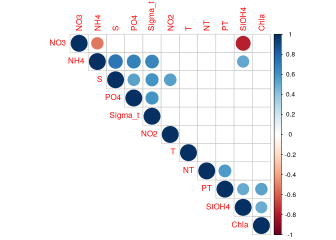<!-- -->

``` r
#on peut voir que bcp sont correlées
```

``` r
# on enlève certaines, et no garde S pour PO4, sigma-t, NH4 et NO2. NO3 pour SiOH4. Chla pour PT

permanova_cor_pars <- vegan::adonis2(physeq_clr_dist ~ S + NO3 + NT + Chla + T,
                                     by = "margin",
                                     data = metadata,
                                     perm = 1000)
permanova_cor_pars
```

    ## Permutation test for adonis under reduced model
    ## Marginal effects of terms
    ## Permutation: free
    ## Number of permutations: 1000
    ## 
    ## vegan::adonis2(formula = physeq_clr_dist ~ S + NO3 + NT + Chla + T, data = metadata, permutations = 1000, by = "margin")
    ##          Df SumOfSqs      R2      F  Pr(>F)  
    ## S         1    568.2 0.10173 2.0376 0.03896 *
    ## NO3       1    215.5 0.03858 0.7727 0.70230  
    ## NT        1    263.4 0.04716 0.9446 0.46653  
    ## Chla      1    170.9 0.03060 0.6129 0.94605  
    ## T         1    304.5 0.05452 1.0921 0.31169  
    ## Residual 12   3346.3 0.59910                 
    ## Total    17   5585.6 1.00000                 
    ## ---
    ## Signif. codes:  0 '***' 0.001 '**' 0.01 '*' 0.05 '.' 0.1 ' ' 1

``` r
#là c'est mieux que le premier test de permanova. On peut voir que la salinité est très significativement related à la variable de réponse, mais on peut voir que le modèle qu'avec la salinité est encore mieux. En gros : les vraies relations entre les variables peuvent etre masked si les variables explicatives sont colinéaires. Cela pose problème dans la création de modèlé qui ammène à des complications dans l'interference de modèle. Prendre le temps d'évaluer la colinéarité c'est le début pour créer des modèles écologiques plus robustes 
```

\#partie 7.2 : analysis of similarité (ANOSIM)

``` r
# pour les diff signif entre deux ou plus classes d'objets basé sur n'importe quelle mesure de (dis)similarité. Cela compare les rangs des distances entre les objets des diff classes avec les ranges des distances des objets dans les classes. C'est un peu la meme base que l'ordination NMDS

#ANOSIM
vegan::anosim(physeq_clr_dist, metadata$Geo, permutations = 1000)
```

    ## 
    ## Call:
    ## vegan::anosim(x = physeq_clr_dist, grouping = metadata$Geo, permutations = 1000) 
    ## Dissimilarity: euclidean 
    ## 
    ## ANOSIM statistic R: 0.5628 
    ##       Significance: 0.001998 
    ## 
    ## Permutation: free
    ## Number of permutations: 1000

``` r
#comme permanova le résultat indique un effet signif de la provenance de l'échantillon sur les commu bac
# une approche plus formelle pour tester des hypothèse peut etre faite par une analyse redondante ou une analyse de correspondance canoniques qui utilise directement l'information sur les champs de metadata en même temps que ça genère les ordinations et les test. Ces approches test directement les hypo à propos des variables envtales
```

\#partie 8 : Direct gradient analysis

``` r
#Les ordinations simples analysent qu'une seule data et revèle la strcuture majeur dans un graphique construit depuis un set réduit d'axes orthogonaux. C'est une forme passive d'analyse, et l'utilisateur interprete le résultat de l'ordination à posteriori. Au contraire, les analyses directe de gradient (aussi appelées ordination canonique) associent deux ou plus set de data dans le processus d'ordination lui-même. En conséquence, si l'un veut extraire les structures du set de data et sont related aux structures dans un autre jeu de données, et / ou veulent tester stastistiquement des hypothèses à propos de la signification des relations, l'odination canonique peut etre bien. on va faire un RDA sur note jeu de données, mais pleins d'autres existent.
```

\#partie 8.1 : RDA : redundant analysis

``` r
#c'est une méthode qui combine la regression et la PCA. ça compute les axes qui sont des combinations linéaires des variables explicatives. Dans RDA, un seul peut vraiment dire que les axes expliquent ou modèlisent la variation de matrice de dépendance.

# RDA of the Aitchinson distance
# constrained by all the environmental variables
# contained in metadata
#
# Observe the shortcut formula
spe_rda <- vegan::rda(t(physeq_clr_asv) ~ .,
                      metadata[, 11:21])
head(summary(spe_rda))  # Scaling 2 (default)
```

    ## 
    ## Call:
    ## rda(formula = t(physeq_clr_asv) ~ SiOH4 + NO2 + NO3 + NH4 + PO4 +      NT + PT + Chla + T + S + Sigma_t, data = metadata[, 11:21]) 
    ## 
    ## Partitioning of variance:
    ##               Inertia Proportion
    ## Total          328.56     1.0000
    ## Constrained    231.46     0.7044
    ## Unconstrained   97.11     0.2956
    ## 
    ## Eigenvalues, and their contribution to the variance 
    ## 
    ## Importance of components:
    ##                          RDA1     RDA2     RDA3     RDA4     RDA5     RDA6
    ## Eigenvalue            85.2928 30.29173 20.29415 18.85659 15.83909 12.98651
    ## Proportion Explained   0.2596  0.09219  0.06177  0.05739  0.04821  0.03952
    ## Cumulative Proportion  0.2596  0.35179  0.41355  0.47094  0.51915  0.55868
    ##                           RDA7     RDA8     RDA9   RDA10   RDA11      PC1
    ## Eigenvalue            11.78027 10.97738 10.18119 7.94385 7.01222 28.88564
    ## Proportion Explained   0.03585  0.03341  0.03099 0.02418 0.02134  0.08791
    ## Cumulative Proportion  0.59453  0.62794  0.65893 0.68310 0.70445  0.79236
    ##                            PC2     PC3      PC4      PC5     PC6
    ## Eigenvalue            16.45693 16.3958 15.58129 11.19715 8.59184
    ## Proportion Explained   0.05009  0.0499  0.04742  0.03408 0.02615
    ## Cumulative Proportion  0.84245  0.8923  0.93977  0.97385 1.00000
    ## 
    ## Accumulated constrained eigenvalues
    ## Importance of components:
    ##                          RDA1    RDA2     RDA3     RDA4     RDA5     RDA6
    ## Eigenvalue            85.2928 30.2917 20.29415 18.85659 15.83909 12.98651
    ## Proportion Explained   0.3685  0.1309  0.08768  0.08147  0.06843  0.05611
    ## Cumulative Proportion  0.3685  0.4994  0.58706  0.66853  0.73696  0.79307
    ##                          RDA7     RDA8     RDA9   RDA10  RDA11
    ## Eigenvalue            11.7803 10.97738 10.18119 7.94385 7.0122
    ## Proportion Explained   0.0509  0.04743  0.04399 0.03432 0.0303
    ## Cumulative Proportion  0.8440  0.89139  0.93538 0.96970 1.0000
    ## 
    ## Scaling 2 for species and site scores
    ## * Species are scaled proportional to eigenvalues
    ## * Sites are unscaled: weighted dispersion equal on all dimensions
    ## * General scaling constant of scores:  8.645047 
    ## 
    ## 
    ## Species scores
    ## 
    ##                                                  RDA1      RDA2     RDA3
    ## ASV1_Cyanobiaceae_Synechococcus CC9902        -0.1033  0.108773  0.04666
    ## ASV2_Pseudoalteromonadaceae_Pseudoalteromonas -0.7807 -0.229145 -0.22860
    ## ASV3_Clade I_Clade Ia                         -0.2568  0.002182 -0.22536
    ## ASV4_NA_NA                                    -0.6996  0.193071  0.23547
    ## ASV5_Clade I_Clade Ia                          0.5264 -0.195773  0.23032
    ## ASV6_Clade II_NA                              -0.2542 -0.344583 -0.32380
    ## ....                                                                    
    ##                                                   RDA4     RDA5     RDA6
    ## ASV1_Cyanobiaceae_Synechococcus CC9902         0.12535 -0.01552  0.06487
    ## ASV2_Pseudoalteromonadaceae_Pseudoalteromonas -0.33352  0.13369  0.08880
    ## ASV3_Clade I_Clade Ia                          0.04191 -0.04528 -0.11436
    ## ASV4_NA_NA                                    -0.20648 -0.23531  0.06807
    ## ASV5_Clade I_Clade Ia                          0.05792  0.40196 -0.22286
    ## ASV6_Clade II_NA                               0.31352 -0.10920 -0.06137
    ## ....                                                                    
    ## 
    ## 
    ## Site scores (weighted sums of species scores)
    ## 
    ##        RDA1     RDA2    RDA3    RDA4     RDA5    RDA6
    ## S11B -1.703 -1.23820  2.9437  0.2362  1.13728 -0.4405
    ## S1B   2.565 -0.13340 -0.7868  5.7453  3.30268 -3.3657
    ## S2B   3.022 -2.96571  0.4021  0.9802 -3.09213  0.9282
    ## S2S  -1.731 -1.82618  2.0707  0.3281 -0.66853 -1.6638
    ## S3B   3.624 -1.55655 -1.2829  2.0701 -2.02586  1.7347
    ## S3S   3.165 -0.08923  2.8998 -2.0441 -0.08464  2.0314
    ## ....                                                 
    ## 
    ## 
    ## Site constraints (linear combinations of constraining variables)
    ## 
    ##         RDA1    RDA2    RDA3    RDA4    RDA5    RDA6
    ## S11B -1.2105 -0.7764  3.0649  0.2199  1.2569  0.7586
    ## S1B   1.7387  0.3983 -0.3817  5.4943  3.2411 -2.7484
    ## S2B   2.0536 -3.3237  0.6260  1.4897 -2.8936  0.1774
    ## S2S   0.5936 -2.0609  1.1588  0.1736 -0.8183 -1.8069
    ## S3B   4.1498 -1.1569 -1.6837  1.1942 -2.4216  2.5295
    ## S3S   2.0704 -0.1285  3.6947 -1.1733  0.3885  1.8438
    ## ....                                                
    ## 
    ## 
    ## Biplot scores for constraining variables
    ## 
    ##             RDA1     RDA2     RDA3     RDA4     RDA5      RDA6
    ## SiOH4   -0.57424 -0.21106 -0.25450 -0.25678 -0.02349 -0.213981
    ## NO2     -0.51463 -0.10086 -0.08171  0.34294  0.35340  0.013696
    ## NO3      0.59878  0.05632 -0.04267 -0.02065 -0.30772  0.095439
    ## NH4     -0.63097 -0.49073 -0.01146 -0.07457  0.25646  0.259440
    ## PO4     -0.49369 -0.05367 -0.31521  0.04459  0.19877  0.304690
    ## NT       0.02778 -0.05873 -0.28198  0.59590  0.14825 -0.392684
    ## PT      -0.61634 -0.27995 -0.01129  0.12013  0.07328 -0.533916
    ## Chla    -0.47936 -0.07832 -0.06090 -0.01293 -0.11376  0.179421
    ## T       -0.57485  0.21879  0.26190  0.53662 -0.42902  0.007286
    ## S       -0.93622  0.00815 -0.06712  0.05543  0.04078  0.183950
    ## Sigma_t -0.52380 -0.20293 -0.31121 -0.40702  0.43162  0.205711

``` r
#les variables envtales inclues expliquent 70,44% de la variation sur la compo de la commu bacterienne dans tous les sites. 29,56% de la variation est inexpliquée. CEpendant, on verra que la proportion de variation expliquée est bien plus basse. Le R2 du résumé le mesure la forme des relations canoniques entre les variables de reponses (Y matrice) et les variables explicatives (X matrice) par calculer la proportion de variable de Y expliqué par la variable de X. Cependant cet R2 est biased. On calcule une R2 ajusté, ce qui mesure aussi la force des relations entre X et Y, mais qui appliques une correlation de R2 pour prendre en compte le nombre de variable expliquées. C'est la stat qu'on doit reportée.

# Unadjusted R^2 retrieved from the rda object
R2 <- vegan::RsquareAdj(spe_rda)$r.squared
R2
```

    ## [1] 0.7044457

``` r
# Adjusted R^2 retrieved from the rda object
R2adj <- vegan::RsquareAdj(spe_rda)$adj.r.squared
R2adj
```

    ## [1] 0.1625961

``` r
#en réalité, la proportion de variance expliquée descend à 16.25%. La sortie numérique montre que les deux premiers axes canoniques expliquent ensemble 35.1% de la bariance total de la data, le premier axe explique 25.9%. mais ce sont des valeurs non ajustées. R2 ajusté = 16.2%, le % de valeurs propres adj contraintes accumulées montre que le premier axe explique 0.162 * 0.368 = 0.059 soit 5.9% de la variance. Parce que la data écologique sont généralement avec du bruit, on ne devrait jamais avoir une valeur haute de R2. De plus, la premiere valeur propre sans contrainte PC1, le premier axe sans contrainte pour les résidus, est comparativement haut, ce qui veut dire que ça affiche une structure de résidus importante de data de réponse qui n'est pas expliqué par les mesures de paramètres envtaux.
```

``` r
#l'interpretation de l'ordination avec contraintes doit etre précédé par un test de signification stat. Comme une régression multiple, un résultat non signif ne doit pas etre interprété et doit etre dégagé.

# Global test of the RDA result
anova(spe_rda, step = 1000)
```

    ## Permutation test for rda under reduced model
    ## Permutation: free
    ## Number of permutations: 999
    ## 
    ## Model: rda(formula = t(physeq_clr_asv) ~ SiOH4 + NO2 + NO3 + NH4 + PO4 + NT + PT + Chla + T + S + Sigma_t, data = metadata[, 11:21])
    ##          Df Variance      F Pr(>F)  
    ## Model    11  231.456 1.3001  0.096 .
    ## Residual  6   97.109                
    ## ---
    ## Signif. codes:  0 '***' 0.001 '**' 0.01 '*' 0.05 '.' 0.1 ' ' 1

``` r
# Tests of all canonical axes
anova(spe_rda, by = "axis", step = 1000)
```

    ## Permutation test for rda under reduced model
    ## Forward tests for axes
    ## Permutation: free
    ## Number of permutations: 999
    ## 
    ## Model: rda(formula = t(physeq_clr_asv) ~ SiOH4 + NO2 + NO3 + NH4 + PO4 + NT + PT + Chla + T + S + Sigma_t, data = metadata[, 11:21])
    ##          Df Variance      F Pr(>F)
    ## RDA1      1   85.293 5.2699  0.108
    ## RDA2      1   30.292 1.8716  0.614
    ## RDA3      1   20.294 1.2539  0.999
    ## RDA4      1   18.857 1.1651  1.000
    ## RDA5      1   15.839 0.9786  1.000
    ## RDA6      1   12.987 0.8024  1.000
    ## RDA7      1   11.780 0.7279  1.000
    ## RDA8      1   10.977 0.6783  1.000
    ## RDA9      1   10.181 0.6291  0.999
    ## RDA10     1    7.944 0.4908  0.993
    ## RDA11     1    7.012 0.4333  0.911
    ## Residual  6   97.109

``` r
#ici on peut voir que tout notre modèle stat n'est pas signif (p=0.08) et que chaque axe canonique préovenant de RDA ne l'est pas non plus (p>0.05). donc on ne peut pas intepréter ce RDA model.
#est-ce qu'on peut dire pourquoi ?
```

``` r
#sélectionner les variables
# ça arrive parfois qu'on veut réduire le nombre de variables explicatives. les raisons dépendent.
#une approche simple pour identifier une colinéarité dans les variables explicatives c'est d'utiliser le VIF (facteur d'inflation de variance). Les calculs de VIF sont facils à comprendre, plus la valeur est haute plus la colinéarité est haute. VIF mesure la proportion par lesquelles la variance d'un coeff de regression est influencé dans la présence d'autres variables explicatives. VIF plus haut que 20 indique une forte collinéarité. Au dessus de 10 on doit réexaminer, et mis de côté si possible.

# Variance inflation factors (VIF)
vegan::vif.cca(spe_rda)
```

    ##       SiOH4         NO2         NO3         NH4         PO4          NT 
    ##    4.066588    3.489186    3.634643   16.867288    8.819736    4.908553 
    ##          PT        Chla           T           S     Sigma_t 
    ##    6.835572    2.264012 5417.455601 8388.550079 6878.896122

``` r
#salinité T° et sigma.t ont une très haute VF qui confirme les colinéarités observés avant entre les variables explicatives (permanova). Une réduction du nombre de variables explicatives est justifiée. Pour simplifier ce modèle, on peut faire une sélection "forward", ou "backwards" ou "stepwise". Ces types de sélection nous aide à selectionner des variables qui sont statistiquement importante. Cependant, c'est important de noter que selectionner des variables écologiques est plus important que performer une sélection dans ce sens. Si une variable d'interet écologique n'est pas sélectionnée, ça ne va pas dire qu'on l'enleve de RDA. Ici, on va faire une sélection "forward" sur nos 11 variables envtales. On peut utiliser la fonction ordiR2step()  :

# Forward selection of explanatory variables using vegan's ordiR2step()
step_forward <- vegan::ordiR2step(vegan::rda(t(physeq_clr_asv) ~ 1,
                                             data = metadata[, 11:21]),
                                  scope = formula(spe_rda),
                                  direction = "forward",
                                  pstep = 1000)
```

    ## Step: R2.adj= 0 
    ## Call: t(physeq_clr_asv) ~ 1 
    ##  
    ##                 R2.adjusted
    ## + S              0.18366030
    ## <All variables>  0.16259613
    ## + NH4            0.08392874
    ## + PT             0.07013415
    ## + T              0.06719602
    ## + NO3            0.05904665
    ## + SiOH4          0.05787026
    ## + Sigma_t        0.05002017
    ## + NO2            0.03846019
    ## + PO4            0.03190148
    ## + Chla           0.02451726
    ## <none>           0.00000000
    ## + NT            -0.01448677

``` r
#ici on peut ajouter une variable à la fois, et la retenir si ça augmente significativement le modèle ajusté de R2. La sélection qui suit nous montre qu'un modèle qu'avec la salinité a un plus haut R2 ajusté qu'un avec toutes les variables et qui explique 18.4% de la variance. 
```

``` r
#on va calculer la RDA la plus partimonieuse et regardé si c'est signif :

# Parsimonious RDA
spe_rda_pars <- vegan::rda(t(physeq_clr_asv) ~ S, data = metadata[, 11:21])
anova(spe_rda_pars, step = 1000)
```

    ## Permutation test for rda under reduced model
    ## Permutation: free
    ## Number of permutations: 999
    ## 
    ## Model: rda(formula = t(physeq_clr_asv) ~ S, data = metadata[, 11:21])
    ##          Df Variance      F Pr(>F)    
    ## Model     1   76.122 4.8247  0.001 ***
    ## Residual 16  252.443                  
    ## ---
    ## Signif. codes:  0 '***' 0.001 '**' 0.01 '*' 0.05 '.' 0.1 ' ' 1

``` r
anova(spe_rda_pars, step = 1000, by = "axis")
```

    ## Permutation test for rda under reduced model
    ## Forward tests for axes
    ## Permutation: free
    ## Number of permutations: 999
    ## 
    ## Model: rda(formula = t(physeq_clr_asv) ~ S, data = metadata[, 11:21])
    ##          Df Variance      F Pr(>F)    
    ## RDA1      1   76.122 4.8247  0.001 ***
    ## Residual 16  252.443                  
    ## ---
    ## Signif. codes:  0 '***' 0.001 '**' 0.01 '*' 0.05 '.' 0.1 ' ' 1

``` r
R2adj_pars <- vegan::RsquareAdj(spe_rda_pars)$adj.r.squared

# Compare variance inflation factors
vegan::vif.cca(spe_rda)
```

    ##       SiOH4         NO2         NO3         NH4         PO4          NT 
    ##    4.066588    3.489186    3.634643   16.867288    8.819736    4.908553 
    ##          PT        Chla           T           S     Sigma_t 
    ##    6.835572    2.264012 5417.455601 8388.550079 6878.896122

``` r
vegan::vif.cca(spe_rda_pars)
```

    ## S 
    ## 1

``` r
#maintenant, chacun des deux, le modèle et le premier axe canonique résulte du RDA sont statistiquement signif (p<0.05). La VIF de la salinité n'est que 1. Ce modèle RDA est interpretable ! on va le plot

# Preparation of the data for the plot
#
# View analysis results
ii <- summary(spe_rda_pars)

# Depending on the drawing result
# the drawing data can be enlarged or
# reduced to a certain extent, as follows
sp <- as.data.frame(ii$species[, 1:2]) * 2
sp_top <- sp[order(abs(sp$RDA1), decreasing = TRUE), ][1:6, ]

st <- as.data.frame(ii$sites[, 1:2])
st <- merge(st,
      metadata["Geo"],
      by = "row.names")

yz <- t(as.data.frame(ii$biplot[, 1:2]))
row.names(yz) <- "Salinity"
yz <- as.data.frame(yz)

eigen_values <- format(100 *ii$cont[[1]][2,], digits=4)

#plot
ggplot() +
  geom_point(data = st, size = 4,
             aes(x = RDA1, y = PC1,
                 shape = Geo, fill = Geo)) +
  scale_shape_manual(values = c(21:25)) +
  geom_segment(data = sp_top,
               arrow = arrow(angle = 22.5,
                             length = unit(0.35, "cm"),
                             type = "closed"),
               linetype = 1, size = 0.6, colour = "red",
               aes(x = 0, y = 0, xend = RDA1, yend = PC1)) +
  ggrepel::geom_text_repel(data = sp_top,
                           aes(x = RDA1, y = PC1, label = row.names(sp_top))) +
  geom_segment(data = yz,
               arrow = arrow(angle = 22.5,
                             length = unit(0.35,"cm"),
                             type = "closed"),
               linetype = 1, size = 0.6, colour = "blue",
               aes(x = 0, y = 0, xend = RDA1, yend = PC1)) +
  ggrepel::geom_text_repel(data = yz, aes(RDA1, PC1, label=row.names(yz)))+
  labs(x = paste("RDA 1 (", eigen_values[1], "%)", sep = ""),
       y = paste("PC 1 (", eigen_values[2], "%)", sep = ""))+
  geom_hline(yintercept = 0,linetype = 3,size = 1) + 
  geom_vline(xintercept = 0,linetype = 3,size = 1)+
  guides(shape = guide_legend(title = NULL,
         color = "black"),
         fill = guide_legend(title = NULL))+
  theme_bw() +
  theme(panel.grid = element_blank())
```

    ## Warning: Using `size` aesthetic for lines was deprecated in ggplot2 3.4.0.
    ## ℹ Please use `linewidth` instead.
    ## This warning is displayed once every 8 hours.
    ## Call `lifecycle::last_lifecycle_warnings()` to see where this warning was
    ## generated.

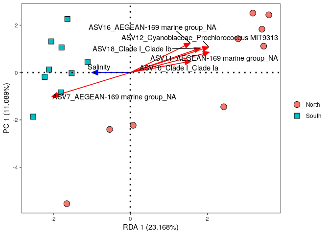<!-- -->

``` r
#l'un des plus fort aspect de RDA est la visualisation simultanée de la réponse et des variables explicatives (sp et variables envtales). Depuis cette ordination, on peut vraiment dire mtn que la salinité est la principale variable envtale mesurée qui faconne les commu bac. Entre toutes les ASV, certaine sont related à ce gradient de salinité. C'est le cas de ASV 11 et 12, dont l'abondance augmente quand la salinité diminue. ASV 7 qui fait l'inverse. On peut analyser de pleins de façon ces diff de pattern, mais ce qui est vraiment puissant avec RDA c'est qu'on fait ressortir les relations de gradients, pas une diff d'abondance entre deux conditions. Cependant, une grande partie de la variance dans la commu bac continue d'être inexpliquée. Les variances dans les commu d'sp peuvent etre expliquées par un processus deterministique comme le "species sorting" (influence de l'envt comme on le voit ici) mais aussi un processus stochastique comme une disperion qui dépend entre autre de la distance entre les commu. 
```

``` r
#Maintenant qu'on a cette info : regardons un pattern commun dans les commu écologique : distance-decay pattern (modèle de décroissance de la distance)
```

\#partie 8.2 : MRM : multiple regression on dissimilarity matrices

``` r
#La décroissance de la similarité des assemblages avec la distance spatiale peut s'expliquer par des mécanismes alternatifs : la limitation de la dispersion et le tri des espèces. Pour comprendre leurs contributions relatives, nous comparons la décroissance de la similarité bac avec la distance spatiale, ainsi qu'indépendamment avec la distance envtale
#Une combinaison de la corrélation de Mantel et de la régression multiple sur les matrices de distance permet une analyse de type régression de deux matrices (dis)similaires ou plus, en utilisant des permutations pour déterminer la signification des coefficients de détermination. Une matrice doit contenir les (dis)similarités calculées à partir des données de réponse, telles que les abondances d'OTU, tandis que les autres matrices doivent contenir les (dis)similarités calculées à partir des données explicatives(par exemple, les paramètres environnementaux ou spatiaux).

#Tout d'abord, nous calculons la matrice de distance spatiale. Pour calculer la distance kilométrique entre les points d'échantillonnage à partir des coordonnées géographiques : le package SpatialEpi et la fonction latlong2grid(). 
```

\#soucis de dimension partout ensuite je comprends pas

``` r
ANF_km <- readRDS(here::here("course-material-main","data","beta_diversity","spatial_distance.rds"))
ANF_km_dist <- dist(ANF_km)
```

``` r
#Calculate and add model to the plot

ANF_decay_exp <- betapart::decay.model(physeq_clr_dist/100,
                                       ANF_km_dist,
                                       y.type="dissim",
                                       model.type="exp",
                                       perm=100)

#Plot Distance decay relationships
plot(ANF_km_dist, physeq_clr_dist/100,
     ylim=c(0, max(physeq_clr_dist/100)),
     xlim=c(0, max(ANF_km_dist)),
     xlab = "Distance (km)", ylab = "Dissimilarity (CLR)")

betapart::plot.decay(ANF_decay_exp, col = "blue",
                     remove.dots = TRUE, add = TRUE)

legend("bottomright",
       paste("exp: (Beta =", round(ANF_decay_exp$second.parameter, 4),
             ", Rsqr =", round(ANF_decay_exp$pseudo.r.squared, 2),
             ", p =", round(ANF_decay_exp$p.value, 2)),
       fill = "blue")
```

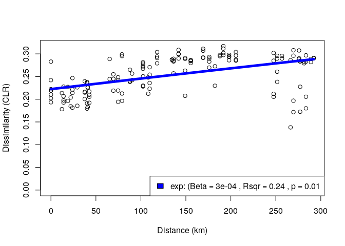<!-- -->

``` r
#Variance partitioning
#Microbiam matrix (response)
physeq_clr_dist_square <- phyloseq::distance(physeq_clr,
                                             method = "euclidean",
                                             diag = TRUE,
                                             upper = TRUE)

#Spatial matrix (explicative)
ANF_km_dist_square <- dist(ANF_km, diag = TRUE, upper = TRUE)

#environmental matrix (explicative)
envdata <- dist(metadata[,11:21], diag = TRUE, upper = TRUE)
```

``` r
#Multiple regressions on Matrices (MRM) - attention les colonnes et lignes des matrices doivent correspondrent (pas besoin d'avoir les mêmes noms)

ecodist::MRM(physeq_clr_dist_square ~ envdata + ANF_km_dist_square, nperm=1000) # 0.366
```

    ## $coef
    ##                    physeq_clr_dist_square  pval
    ## Int                           19.45167946 0.908
    ## envdata                        1.28567618 0.001
    ## ANF_km_dist_square             0.01828172 0.001
    ## 
    ## $r.squared
    ##       R2     pval 
    ## 0.366774 0.001000 
    ## 
    ## $F.test
    ##        F   F.pval 
    ## 43.44112  0.00100

``` r
ecodist::MRM(physeq_clr_dist_square ~ envdata, nperm=1000) # 0.212
```

    ## $coef
    ##         physeq_clr_dist_square  pval
    ## Int                  21.042622 0.967
    ## envdata               1.609333 0.001
    ## 
    ## $r.squared
    ##        R2      pval 
    ## 0.2122659 0.0010000 
    ## 
    ## $F.test
    ##        F   F.pval 
    ## 40.68905  0.00100

``` r
ecodist::MRM(physeq_clr_dist_square ~ ANF_km_dist_square, nperm=1000) # 0.238
```

    ## $coef
    ##                    physeq_clr_dist_square  pval
    ## Int                           22.34249373 0.354
    ## ANF_km_dist_square             0.02210456 0.004
    ## 
    ## $r.squared
    ##        R2      pval 
    ## 0.2384328 0.0040000 
    ## 
    ## $F.test
    ##        F   F.pval 
    ## 47.27535  0.00400

``` r
modEvA::varPart(A = 0.212, B = 0.238, AB = 0.366,
                A.name = "Environmental",
                B.name = "Dispersal limitation")
```

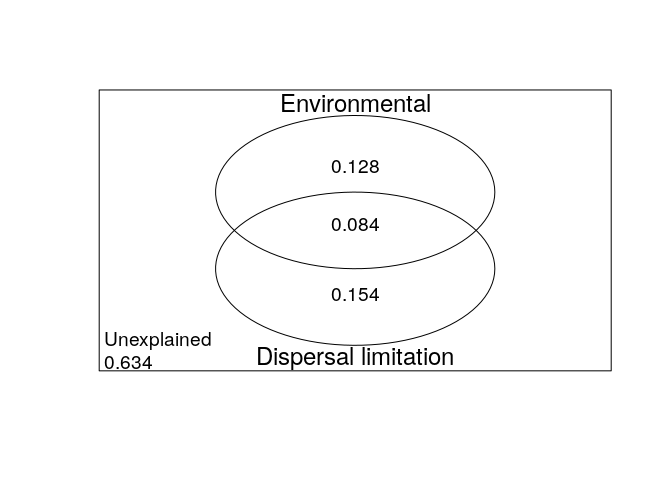<!-- -->

    ##                                    Proportion
    ## Environmental                           0.128
    ## Dispersal limitation                    0.154
    ## Environmental_Dispersal limitation      0.084
    ## Unexplained                             0.634

``` r
#En utilisant la régression multiple sur les matrices de distance (MRM), les variables spatiales et environnementales se sont avérées être des prédicteurs significatifs de la diversité bêta et ont ensemble expliqué 36,7 % de la variation dans la dissimilarité des communautés microbiennes. Ensuite, nous avons utilisé la partition de la variance pour répartir la variation en composantes purement spatiales, purement environnementales et environnementales structurées spatialement. Avec 15,4 %, la quantité de variation dans la dissimilarité expliquée par la composante purement spatiale était plus élevée que la variation expliquée par la composante environnementale, ce qui indique que la dispersion est un processus important façonnant nos communautés.

#De manière similaire aux analyses de gradient indirect, de nombreux types d'analyses de gradient direct sont disponibles. Dans le graphique suivant, nous proposons des suggestions de choix appropriés en fonction de la structure des données en entrée et des relations attendues entre les variables.
```

\#partie 9 : DAA : differential abundance analysis

``` r
#L'objectif des tests de différence d'abondance (DAA) est d'identifier des taxons spécifiques associés à des variables de métadonnées d'intérêt. Il s'agit d'une tâche difficile et l'une des zones les plus controversées de l'analyse des données microbiomiques, comme illustré dans cette prépublication. Cela est lié à des préoccupations selon lesquelles les approches de normalisation et de test ont généralement échoué à contrôler les taux de découvertes fausses.

#Il existe de nombreux outils pour effectuer des DAA. Les outils les plus populaires, sans entrer dans l'évaluation de leur performance pour cette tâche, sont : (ALDEx2, ANCOM-BC, conrcob, DESeq2, edgeR, LEFse, limma voom, LinDA,MaAsLin2, metagenomeSeq, IndVal,t-test, Test de Wilcoxon)

#des gens ont comparé toutes ces méthodes répertoriées sur 38 ensembles de données différents et ont montré que ALDEx2 et ANCOM-BC produisent les résultats les plus cohérents entre les études. Étant donné que différentes méthodes utilisent différentes approches (paramétriques vs non paramétriques, techniques de normalisation différentes, hypothèses, etc.), les résultats peuvent différer entre les méthodes. Par conséquent, il est fortement recommandé de choisir plusieurs méthodes pour avoir une idée de la robustesse et de la reproductibilité potentielle de vos résultats en fonction de la méthode. trois méthodes utilisées en écologie microbienne (ANCOM-BC, ALDEx2 et LEFse), et nous comparerons les résultats entre elles : package microbiome_marker récent.
```

\#partie 9.1 : Linear discriminant analysis Effect Size (LEFse)

``` r
#LEFSE a été dvp par des gens. LEFSE utilise tout d'abord le test non paramétrique de Kruskal-Wallis (KW) à somme de rangs pour détecter les caractéristiques présentant des abondances différentielles significatives par rapport à la classe d'intérêt ; la cohérence biologique est ensuite examinée en utilisant un ensemble de tests par paires entre les sous-classes à l'aide du test de somme de rangs Wilcoxon (non apparié). En dernière étape, LEfSe utilise l'analyse discriminante linéaire (LDA) pour estimer la taille de l'effet de chaque caractéristique présentant une abondance différentielle.

#LEFSE
mm_lefse <- microbiomeMarker::run_lefse(physeq, norm = "CPM",
                                        wilcoxon_cutoff = 0.01,
                                        group = "Geo",
                                        taxa_rank = "none",
                                        kw_cutoff = 0.01,
                                        multigrp_strat = TRUE,
                                        lda_cutoff = 4)
```

    ## Registered S3 method overwritten by 'httr':
    ##   method         from  
    ##   print.response rmutil

    ## Registered S3 methods overwritten by 'treeio':
    ##   method              from    
    ##   MRCA.phylo          tidytree
    ##   MRCA.treedata       tidytree
    ##   Nnode.treedata      tidytree
    ##   Ntip.treedata       tidytree
    ##   ancestor.phylo      tidytree
    ##   ancestor.treedata   tidytree
    ##   child.phylo         tidytree
    ##   child.treedata      tidytree
    ##   full_join.phylo     tidytree
    ##   full_join.treedata  tidytree
    ##   groupClade.phylo    tidytree
    ##   groupClade.treedata tidytree
    ##   groupOTU.phylo      tidytree
    ##   groupOTU.treedata   tidytree
    ##   inner_join.phylo    tidytree
    ##   inner_join.treedata tidytree
    ##   is.rooted.treedata  tidytree
    ##   nodeid.phylo        tidytree
    ##   nodeid.treedata     tidytree
    ##   nodelab.phylo       tidytree
    ##   nodelab.treedata    tidytree
    ##   offspring.phylo     tidytree
    ##   offspring.treedata  tidytree
    ##   parent.phylo        tidytree
    ##   parent.treedata     tidytree
    ##   root.treedata       tidytree
    ##   rootnode.phylo      tidytree
    ##   sibling.phylo       tidytree

    ## Registered S3 method overwritten by 'gplots':
    ##   method         from     
    ##   reorder.factor DescTools

    ## Found more than one class "phylo" in cache; using the first, from namespace 'phyloseq'

    ## Also defined by 'tidytree'

    ## Found more than one class "phylo" in cache; using the first, from namespace 'phyloseq'

    ## Also defined by 'tidytree'

    ## Found more than one class "phylo" in cache; using the first, from namespace 'phyloseq'

    ## Also defined by 'tidytree'

    ## Found more than one class "phylo" in cache; using the first, from namespace 'phyloseq'

    ## Also defined by 'tidytree'

    ## Found more than one class "phylo" in cache; using the first, from namespace 'phyloseq'

    ## Also defined by 'tidytree'

    ## Found more than one class "phylo" in cache; using the first, from namespace 'phyloseq'

    ## Also defined by 'tidytree'

    ## Found more than one class "phylo" in cache; using the first, from namespace 'phyloseq'

    ## Also defined by 'tidytree'

    ## Found more than one class "phylo" in cache; using the first, from namespace 'phyloseq'

    ## Also defined by 'tidytree'

    ## Found more than one class "phylo" in cache; using the first, from namespace 'phyloseq'

    ## Also defined by 'tidytree'

    ## Found more than one class "phylo" in cache; using the first, from namespace 'phyloseq'

    ## Also defined by 'tidytree'

    ## Found more than one class "phylo" in cache; using the first, from namespace 'phyloseq'

    ## Also defined by 'tidytree'

    ## Found more than one class "phylo" in cache; using the first, from namespace 'phyloseq'

    ## Also defined by 'tidytree'

    ## Found more than one class "phylo" in cache; using the first, from namespace 'phyloseq'

    ## Also defined by 'tidytree'

    ## Found more than one class "phylo" in cache; using the first, from namespace 'phyloseq'

    ## Also defined by 'tidytree'

    ## Found more than one class "phylo" in cache; using the first, from namespace 'phyloseq'

    ## Also defined by 'tidytree'

    ## Found more than one class "phylo" in cache; using the first, from namespace 'phyloseq'

    ## Also defined by 'tidytree'

    ## Found more than one class "phylo" in cache; using the first, from namespace 'phyloseq'

    ## Also defined by 'tidytree'

    ## Found more than one class "phylo" in cache; using the first, from namespace 'phyloseq'

    ## Also defined by 'tidytree'

    ## Found more than one class "phylo" in cache; using the first, from namespace 'phyloseq'

    ## Also defined by 'tidytree'

    ## Found more than one class "phylo" in cache; using the first, from namespace 'phyloseq'

    ## Also defined by 'tidytree'

    ## Found more than one class "phylo" in cache; using the first, from namespace 'phyloseq'

    ## Also defined by 'tidytree'

``` r
mm_lefse_table <- data.frame(mm_lefse@marker_table)
mm_lefse_table
```

    ##          feature enrich_group   ef_lda       pvalue         padj
    ## marker1    ASV11        North 4.746047 0.0015574784 0.0015574784
    ## marker2    ASV12        North 4.699727 0.0045142882 0.0045142882
    ## marker3    ASV10        North 4.661376 0.0022950748 0.0022950748
    ## marker4    ASV18        North 4.460565 0.0045142882 0.0045142882
    ## marker5    ASV35        North 4.183570 0.0045142882 0.0045142882
    ## marker6    ASV49        North 4.025863 0.0045142882 0.0045142882
    ## marker7     ASV2        South 4.950924 0.0039173223 0.0039173223
    ## marker8     ASV8        South 4.706448 0.0020814438 0.0020814438
    ## marker9     ASV7        South 4.670957 0.0010275895 0.0010275895
    ## marker10    ASV3        South 4.433849 0.0091897421 0.0091897421
    ## marker11   ASV13        South 4.406032 0.0073724319 0.0073724319
    ## marker12   ASV27        South 4.333577 0.0008112059 0.0008112059

``` r
p_LDAsc <- microbiomeMarker::plot_ef_bar(mm_lefse)
y_labs <- ggplot_build(p_LDAsc)$layout$panel_params[[1]]$y$get_labels()
p_abd <- microbiomeMarker::plot_abundance(mm_lefse, group = "Geo") +
  scale_y_discrete(limits = y_labs)
```

    ## Scale for y is already present.
    ## Adding another scale for y, which will replace the existing scale.

``` r
gridExtra::grid.arrange(p_LDAsc, p_abd, nrow = 1)
```

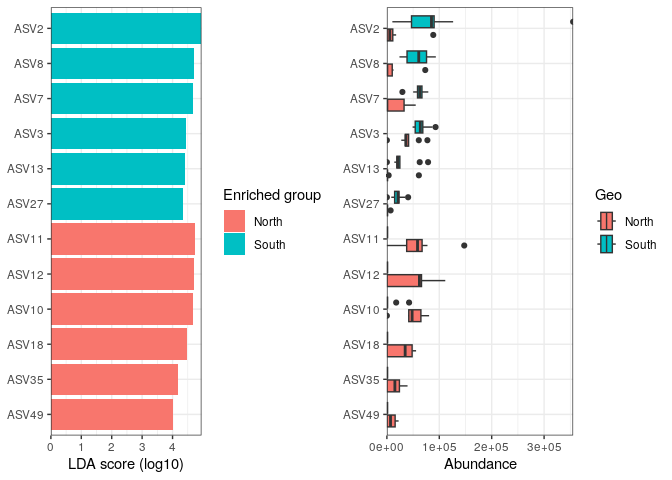<!-- -->

``` r
#LEFse identifie 12 biomarqueurs, parmi lesquels ASV 7, 11 et 12 que nous avions déjà identifiés précédemment avec d'autres méthodes.
```

\#partie 9.2 : differential analysis of compositions of microbiomes with
bias correction (ANCOM-BC) \#fonctionne pas

``` r
#La méthodologie ANCOM-BC suppose que l'échantillon observé est une fraction inconnue d'un volume unitaire de l'écosystème, et que la fraction d'échantillonnage varie d'un échantillon à l'autre. ANCOM-BC prend en compte la fraction d'échantillonnage en introduisant un terme de correction spécifique à l'échantillon dans un cadre de régression linéaire, qui est estimé à partir des données observées. Le terme de correction sert de correction de biais, et le cadre de régression linéaire en échelle logarithmique est analogue à la transformation en log-ratio pour traiter la composition des données microbiomiques. De plus, cette méthode fournit des valeurs p et des intervalles de confiance pour chaque taxon. Elle contrôle également le taux de découvertes fausses (FDR) et est simple du point de vue de sa mise en œuvre sur le plan computationnel.

#ça marche pas 
#ancomBC

install.packages("ANCOMBC")
```

    ## Installing package into '/usr/local/lib/R/site-library'
    ## (as 'lib' is unspecified)

    ## Warning: package 'ANCOMBC' is not available for this version of R
    ## 
    ## A version of this package for your version of R might be available elsewhere,
    ## see the ideas at
    ## https://cran.r-project.org/doc/manuals/r-patched/R-admin.html#Installing-packages

``` r
library(ANCOMBC)
```

``` r
mm_ancombc <- run_ancombc_patched(
  physeq,
  group = "Geo",
  taxa_rank = "none",
  pvalue_cutoff = 0.001,
  p_adjust = "fdr"
)
```

    ## Found more than one class "phylo" in cache; using the first, from namespace 'phyloseq'

    ## Also defined by 'tidytree'

    ## Found more than one class "phylo" in cache; using the first, from namespace 'phyloseq'

    ## Also defined by 'tidytree'

    ## Found more than one class "phylo" in cache; using the first, from namespace 'phyloseq'

    ## Also defined by 'tidytree'

    ## Found more than one class "phylo" in cache; using the first, from namespace 'phyloseq'

    ## Also defined by 'tidytree'

    ## Found more than one class "phylo" in cache; using the first, from namespace 'phyloseq'

    ## Also defined by 'tidytree'

    ## Found more than one class "phylo" in cache; using the first, from namespace 'phyloseq'

    ## Also defined by 'tidytree'

    ## Found more than one class "phylo" in cache; using the first, from namespace 'phyloseq'

    ## Also defined by 'tidytree'

    ## Found more than one class "phylo" in cache; using the first, from namespace 'phyloseq'

    ## Also defined by 'tidytree'

    ## Found more than one class "phylo" in cache; using the first, from namespace 'phyloseq'

    ## Also defined by 'tidytree'

    ## Found more than one class "phylo" in cache; using the first, from namespace 'phyloseq'

    ## Also defined by 'tidytree'

    ## Found more than one class "phylo" in cache; using the first, from namespace 'phyloseq'

    ## Also defined by 'tidytree'

    ## Found more than one class "phylo" in cache; using the first, from namespace 'phyloseq'

    ## Also defined by 'tidytree'

    ## Found more than one class "phylo" in cache; using the first, from namespace 'phyloseq'

    ## Also defined by 'tidytree'

    ## Found more than one class "phylo" in cache; using the first, from namespace 'phyloseq'

    ## Also defined by 'tidytree'

    ## Found more than one class "phylo" in cache; using the first, from namespace 'phyloseq'

    ## Also defined by 'tidytree'

    ## Found more than one class "phylo" in cache; using the first, from namespace 'phyloseq'

    ## Also defined by 'tidytree'

    ## Found more than one class "phylo" in cache; using the first, from namespace 'phyloseq'

    ## Also defined by 'tidytree'

    ## Found more than one class "phylo" in cache; using the first, from namespace 'phyloseq'

    ## Also defined by 'tidytree'

    ## Found more than one class "phylo" in cache; using the first, from namespace 'phyloseq'

    ## Also defined by 'tidytree'

    ## Found more than one class "phylo" in cache; using the first, from namespace 'phyloseq'

    ## Also defined by 'tidytree'

    ## Found more than one class "phylo" in cache; using the first, from namespace 'phyloseq'

    ## Also defined by 'tidytree'

    ## Found more than one class "phylo" in cache; using the first, from namespace 'phyloseq'

    ## Also defined by 'tidytree'

    ## Found more than one class "phylo" in cache; using the first, from namespace 'phyloseq'

    ## Also defined by 'tidytree'

    ## Found more than one class "phylo" in cache; using the first, from namespace 'phyloseq'

    ## Also defined by 'tidytree'

    ## Found more than one class "phylo" in cache; using the first, from namespace 'phyloseq'

    ## Also defined by 'tidytree'

    ## 'ancombc' has been fully evolved to 'ancombc2'. 
    ## Explore the enhanced capabilities of our refined method!

    ## Found more than one class "phylo" in cache; using the first, from namespace 'phyloseq'

    ## Also defined by 'tidytree'

    ## Found more than one class "phylo" in cache; using the first, from namespace 'phyloseq'

    ## Also defined by 'tidytree'

    ## `tax_level` is not specified 
    ## No agglomeration will be performed
    ## Otherwise, please specify `tax_level` by one of the following:

    ## Found more than one class "phylo" in cache; using the first, from namespace 'phyloseq'

    ## Also defined by 'tidytree'

    ## Found more than one class "phylo" in cache; using the first, from namespace 'phyloseq'

    ## Also defined by 'tidytree'

    ## Found more than one class "phylo" in cache; using the first, from namespace 'phyloseq'

    ## Also defined by 'tidytree'

    ## Found more than one class "phylo" in cache; using the first, from namespace 'phyloseq'

    ## Also defined by 'tidytree'

    ## Warning: The group variable has < 3 categories 
    ## The multi-group comparisons (global/pairwise/dunnet/trend) will be deactivated

    ## Loading required package: foreach

    ## Loading required package: rngtools

``` r
mm_ancombc_table <- data.frame(mm_ancombc@marker_table)
mm_ancombc_table
```

    ##          feature enrich_group      ef_W       pvalue         padj
    ## marker1     ASV2        South  3.980197 6.885820e-05 7.230111e-04
    ## marker2     ASV7        South  4.341347 1.416118e-05 1.652137e-04
    ## marker3     ASV8        South  4.532481 5.829496e-06 1.020162e-04
    ## marker4    ASV10        North -4.775089 1.796277e-06 6.286968e-05
    ## marker5    ASV11        North -5.811580 6.188594e-09 3.249012e-07
    ## marker6    ASV12        North -4.466839 7.938375e-06 1.041912e-04
    ## marker7    ASV18        North -4.561024 5.090471e-06 1.020162e-04
    ## marker8    ASV27        South  5.874154 4.250091e-09 3.249012e-07
    ## marker9    ASV35        North -4.483869 7.330158e-06 1.041912e-04
    ## marker10   ASV49        North -4.680720 2.858686e-06 7.504051e-05

``` r
an_ef <- microbiomeMarker::plot_ef_bar(mm_ancombc)
y_labs <- ggplot_build(an_ef)$layout$panel_params[[1]]$y$get_labels()
an_abd <- microbiomeMarker::plot_abundance(mm_ancombc, group = "Geo") +
  scale_y_discrete(limits = y_labs)
```

    ## Scale for y is already present.
    ## Adding another scale for y, which will replace the existing scale.

``` r
gridExtra::grid.arrange(an_ef, an_abd, nrow = 1)
```

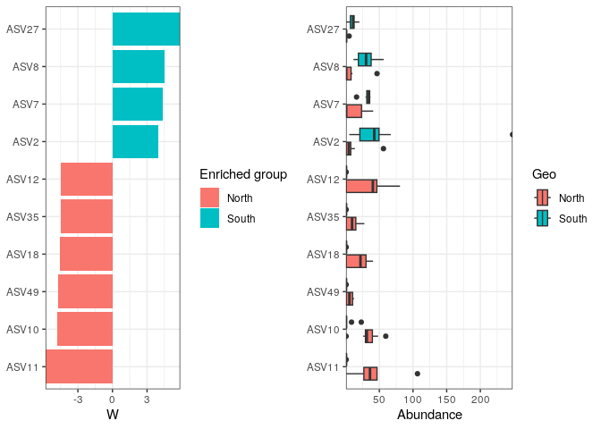<!-- -->

``` r
#AnCOM-BC identifie 10 biomarqueurs et tout en commun avec les résultats de l'analyse LEFse (si ça fonctionnait)
```

\#partie 9.3 : anova-like differential expression (ALDEx2)

``` r
#ALDEx2 estime la variation technique au sein de chaque échantillon par taxon en utilisant la distribution de Dirichlet. De plus, il applique la transformation du logarithme centralisé sur le rapport (ou des transformations de rapports de logarithmes étroitement liées). Selon la configuration expérimentale, il effectuera un test T de Welch à deux échantillons et un test de Wilcoxon, ou une analyse de variance à un facteur et un test de Kruskal-Wallis. La procédure de Benjamini-Hochberg est appliquée dans tous les cas pour corriger les tests multiples.

mm_aldex <- microbiomeMarker::run_aldex(physeq, group = "Geo",
                                        norm = "CPM",
                                        taxa_rank = "none",
                                        p_adjust = "fdr")
```

    ## Found more than one class "phylo" in cache; using the first, from namespace 'phyloseq'

    ## Also defined by 'tidytree'

    ## Found more than one class "phylo" in cache; using the first, from namespace 'phyloseq'

    ## Also defined by 'tidytree'

    ## Found more than one class "phylo" in cache; using the first, from namespace 'phyloseq'

    ## Also defined by 'tidytree'

    ## Found more than one class "phylo" in cache; using the first, from namespace 'phyloseq'

    ## Also defined by 'tidytree'

    ## Found more than one class "phylo" in cache; using the first, from namespace 'phyloseq'

    ## Also defined by 'tidytree'

    ## Found more than one class "phylo" in cache; using the first, from namespace 'phyloseq'

    ## Also defined by 'tidytree'

    ## Found more than one class "phylo" in cache; using the first, from namespace 'phyloseq'

    ## Also defined by 'tidytree'

    ## Found more than one class "phylo" in cache; using the first, from namespace 'phyloseq'

    ## Also defined by 'tidytree'

    ## Found more than one class "phylo" in cache; using the first, from namespace 'phyloseq'

    ## Also defined by 'tidytree'

    ## Found more than one class "phylo" in cache; using the first, from namespace 'phyloseq'

    ## Also defined by 'tidytree'

    ## Found more than one class "phylo" in cache; using the first, from namespace 'phyloseq'

    ## Also defined by 'tidytree'

    ## Found more than one class "phylo" in cache; using the first, from namespace 'phyloseq'

    ## Also defined by 'tidytree'

    ## Found more than one class "phylo" in cache; using the first, from namespace 'phyloseq'

    ## Also defined by 'tidytree'

    ## Found more than one class "phylo" in cache; using the first, from namespace 'phyloseq'

    ## Also defined by 'tidytree'

    ## Found more than one class "phylo" in cache; using the first, from namespace 'phyloseq'

    ## Also defined by 'tidytree'

    ## Found more than one class "phylo" in cache; using the first, from namespace 'phyloseq'

    ## Also defined by 'tidytree'

    ## Found more than one class "phylo" in cache; using the first, from namespace 'phyloseq'

    ## Also defined by 'tidytree'

    ## Found more than one class "phylo" in cache; using the first, from namespace 'phyloseq'

    ## Also defined by 'tidytree'

    ## Found more than one class "phylo" in cache; using the first, from namespace 'phyloseq'

    ## Also defined by 'tidytree'

    ## Found more than one class "phylo" in cache; using the first, from namespace 'phyloseq'

    ## Also defined by 'tidytree'

    ## Found more than one class "phylo" in cache; using the first, from namespace 'phyloseq'

    ## Also defined by 'tidytree'

    ## operating in serial mode

    ## Warning: Not all reads are integers, the reads are ceiled to integers.
    ##    Raw reads is recommended from the ALDEx2 paper.

    ## operating in serial mode

    ## computing center with all features

    ## New names:
    ## • `` -> `...1`
    ## • `` -> `...2`
    ## • `` -> `...3`
    ## • `` -> `...4`
    ## • `` -> `...5`
    ## • `` -> `...6`
    ## • `` -> `...7`
    ## • `` -> `...8`
    ## • `` -> `...9`
    ## • `` -> `...10`
    ## • `` -> `...11`
    ## • `` -> `...12`
    ## • `` -> `...13`
    ## • `` -> `...14`
    ## • `` -> `...15`
    ## • `` -> `...16`
    ## • `` -> `...17`
    ## • `` -> `...18`
    ## • `` -> `...19`
    ## • `` -> `...20`
    ## • `` -> `...21`
    ## • `` -> `...22`
    ## • `` -> `...23`
    ## • `` -> `...24`
    ## • `` -> `...25`
    ## • `` -> `...26`
    ## • `` -> `...27`
    ## • `` -> `...28`
    ## • `` -> `...29`
    ## • `` -> `...30`
    ## • `` -> `...31`
    ## • `` -> `...32`
    ## • `` -> `...33`
    ## • `` -> `...34`
    ## • `` -> `...35`
    ## • `` -> `...36`
    ## • `` -> `...37`
    ## • `` -> `...38`
    ## • `` -> `...39`
    ## • `` -> `...40`
    ## • `` -> `...41`
    ## • `` -> `...42`
    ## • `` -> `...43`
    ## • `` -> `...44`
    ## • `` -> `...45`
    ## • `` -> `...46`
    ## • `` -> `...47`
    ## • `` -> `...48`
    ## • `` -> `...49`
    ## • `` -> `...50`
    ## • `` -> `...51`
    ## • `` -> `...52`
    ## • `` -> `...53`
    ## • `` -> `...54`
    ## • `` -> `...55`
    ## • `` -> `...56`
    ## • `` -> `...57`
    ## • `` -> `...58`
    ## • `` -> `...59`
    ## • `` -> `...60`
    ## • `` -> `...61`
    ## • `` -> `...62`
    ## • `` -> `...63`
    ## • `` -> `...64`
    ## • `` -> `...65`
    ## • `` -> `...66`
    ## • `` -> `...67`
    ## • `` -> `...68`
    ## • `` -> `...69`
    ## • `` -> `...70`
    ## • `` -> `...71`
    ## • `` -> `...72`
    ## • `` -> `...73`
    ## • `` -> `...74`
    ## • `` -> `...75`
    ## • `` -> `...76`
    ## • `` -> `...77`
    ## • `` -> `...78`
    ## • `` -> `...79`
    ## • `` -> `...80`
    ## • `` -> `...81`
    ## • `` -> `...82`
    ## • `` -> `...83`
    ## • `` -> `...84`
    ## • `` -> `...85`
    ## • `` -> `...86`
    ## • `` -> `...87`
    ## • `` -> `...88`
    ## • `` -> `...89`
    ## • `` -> `...90`
    ## • `` -> `...91`
    ## • `` -> `...92`
    ## • `` -> `...93`
    ## • `` -> `...94`
    ## • `` -> `...95`
    ## • `` -> `...96`
    ## • `` -> `...97`
    ## • `` -> `...98`
    ## • `` -> `...99`
    ## • `` -> `...100`
    ## • `` -> `...101`
    ## • `` -> `...102`
    ## • `` -> `...103`
    ## • `` -> `...104`
    ## • `` -> `...105`
    ## • `` -> `...106`
    ## • `` -> `...107`
    ## • `` -> `...108`
    ## • `` -> `...109`
    ## • `` -> `...110`
    ## • `` -> `...111`
    ## • `` -> `...112`
    ## • `` -> `...113`
    ## • `` -> `...114`
    ## • `` -> `...115`
    ## • `` -> `...116`
    ## • `` -> `...117`
    ## • `` -> `...118`
    ## • `` -> `...119`
    ## • `` -> `...120`
    ## • `` -> `...121`
    ## • `` -> `...122`
    ## • `` -> `...123`
    ## • `` -> `...124`
    ## • `` -> `...125`
    ## • `` -> `...126`
    ## • `` -> `...127`
    ## • `` -> `...128`

``` r
mm_aldex_table <- data.frame(mm_aldex@marker_table)
mm_aldex_table
```

    ##         feature enrich_group ef_aldex       pvalue       padj
    ## marker1   ASV27        North 2.095543 0.0003582814 0.03277281

``` r
#ALDEx2 est beaucoup plus strict et identifie uniquement 1 biomarqueur, l'ASV 27, qui a été identifié par les deux autres méthodes d'analyse de l'abondance différentielle (DAA). Les autres ne parviennent pas à atteindre le seuil de contrôle du taux de découvertes fausses (FDR) utilisé ici, bien qu'ils aient probablement des tailles d'effet assez importantes. Souvent, lorsque je considère la réalisation de tests d'abondance différentielle (DA), j'exécute plusieurs modèles et me concentre sur l'intersection des OTUs (Unités Taxonomiques Opérationnelles) données par au moins deux méthodes. Ici, il s'agirait des 10 ASV identifiés avec ANCOM-BC.
```

\#et c’est finiiii, dommage que la fin ne fonctionne pas :(
